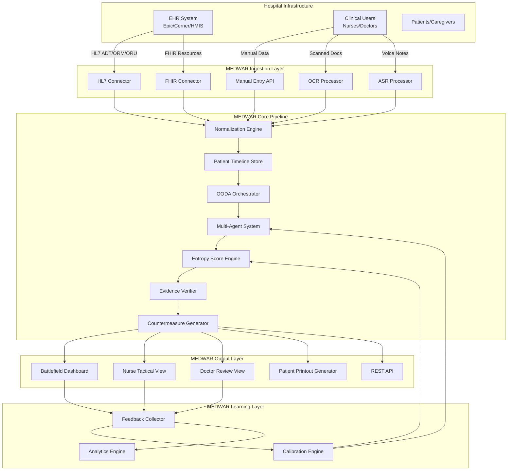
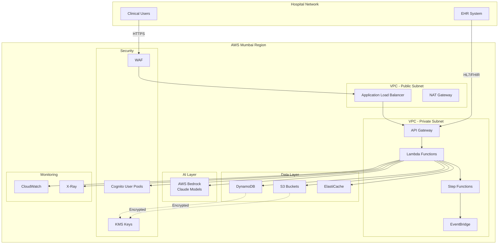
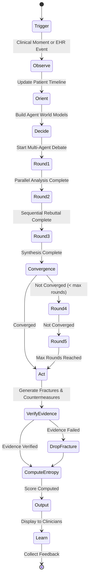
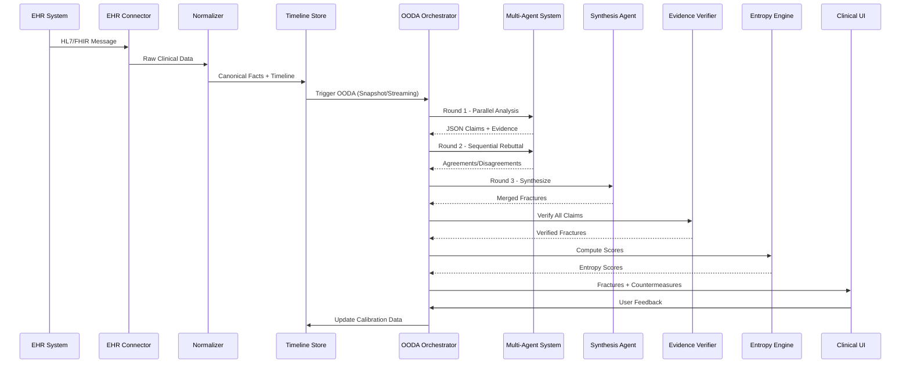

# Design Document: MEDWAR Clinical Threat Intelligence Engine

## Overview

MEDWAR is a production-grade Clinical Threat Intelligence Engine that detects, quantifies, and mitigates semantic fractures in hospital care delivery through multi-agent adversarial analysis. The system operates on the principle that hospital failures often stem from predictable communication breakdowns between clinical roles operating under asymmetric information and competing objectives.

### Core Architecture Principles

1. **Multi-Agent Adversarial Analysis**: Six specialized agents (Nurse, Doctor, PCP, Patient, Adversary, Compliance) conduct structured debates to identify semantic fractures from different role perspectives
2. **Evidence-Grounded Detection**: Three-layer verification ensures all fracture claims are backed by verifiable source data, preventing hallucinations
3. **Calibrated Risk Scoring**: Four-layer entropy scoring combines heuristics, LLM consistency, data quality, and statistical calibration
4. **Real-Time and Retrospective Modes**: Supports triggered analysis (Snapshot OODA), continuous monitoring (Streaming OODA), and historical audit
5. **Patient-Centric Output**: Generates multilingual, grade-6 readable discharge instructions with teach-back validation
6. **Continuous Learning**: Feedback loop updates calibration, thresholds, and hospital-specific patterns

### System Boundaries

**In Scope:**
- Semantic fracture detection and risk quantification
- Role-specific countermeasure generation
- Patient comprehension aids and discharge instructions
- Real-time monitoring and retrospective analysis
- EHR integration via HL7/FHIR standards
- Feedback collection and learning loop

**Out of Scope:**
- Autonomous diagnosis or treatment decisions
- Autonomous prescription or order generation
- Direct modification of EHR records
- Real-time vital sign monitoring hardware
- Medical device integration beyond data ingestion

### Technology Stack

- **Frontend**: React PWA (offline-first), TypeScript, TailwindCSS
- **Backend**: AWS Lambda (Node.js/Python), Step Functions, EventBridge, SNS/SQS
- **Data Layer**: DynamoDB (patient state), S3 (raw data), ElastiCache (caching)
- **AI Layer**: AWS Bedrock (Claude 3 Sonnet/Opus/Haiku), structured JSON outputs
- **Integration**: HL7 v2.x, FHIR R4, REST APIs
- **Security**: AWS KMS, Cognito, IAM, VPC, Mumbai region data residency
- **Monitoring**: CloudWatch, X-Ray, custom dashboards


## Architecture

### High-Level System Architecture



### Deployment Architecture




### OODA Loop Architecture



### Data Flow Architecture




## Components and Interfaces

### 1. EHR Connector Component

**Purpose**: Ingest clinical data from hospital EHR systems via HL7 v2.x and FHIR R4 standards.

**Interfaces**:
```typescript
interface EHRConnector {
  // HL7 v2.x ingestion
  ingestHL7Message(message: HL7Message): Promise<IngestionResult>;
  
  // FHIR R4 ingestion
  ingestFHIRResource(resource: FHIRResource): Promise<IngestionResult>;
  
  // Connection management
  configureEndpoint(config: EHREndpointConfig): Promise<void>;
  testConnection(): Promise<ConnectionStatus>;
  
  // Error handling
  retryFailedMessage(messageId: string): Promise<IngestionResult>;
}

interface HL7Message {
  messageType: 'ADT' | 'ORM' | 'ORU' | 'MDM';
  segments: HL7Segment[];
  timestamp: Date;
  sourceSystem: string;
}

interface FHIRResource {
  resourceType: 'Patient' | 'Observation' | 'MedicationRequest' | 'Encounter' | 'Condition';
  id: string;
  data: any; // FHIR R4 compliant JSON
}

interface IngestionResult {
  success: boolean;
  messageId: string;
  patientId: string;
  errors?: string[];
  normalizedFacts: ClinicalFact[];
}
```

**Implementation Details**:
- Supports Epic, Cerner, and Indian HMIS vendors
- Implements exponential backoff retry (3 attempts, 1s/2s/4s delays)
- Validates message structure against HL7 v2.x and FHIR R4 schemas
- Extracts patient demographics, vitals, lab results, medications, encounters
- Stores raw messages in S3 for audit trail
- Publishes ingestion events to EventBridge for downstream processing

### 2. Normalization Engine Component

**Purpose**: Convert heterogeneous clinical data into canonical Patient Timeline format with extracted structured facts.

**Interfaces**:
```typescript
interface NormalizationEngine {
  normalize(rawData: RawClinicalData): Promise<NormalizationResult>;
  expandAbbreviation(abbrev: string, hospitalId: string): string;
  extractFacts(text: string): Promise<ClinicalFact[]>;
  resolveTemporalReference(ref: string, context: TemporalContext): Date;
}

interface RawClinicalData {
  source: 'HL7' | 'FHIR' | 'PDF' | 'OCR' | 'ASR' | 'MANUAL';
  patientId: string;
  content: any;
  timestamp: Date;
  confidence?: number; // For OCR/ASR
}

interface NormalizationResult {
  patientTimeline: PatientTimeline;
  extractedFacts: ClinicalFact[];
  qualityFlags: DataQualityFlag[];
}

interface PatientTimeline {
  patientId: string;
  events: TimelineEvent[];
  currentState: PatientState;
}

interface TimelineEvent {
  eventId: string;
  timestamp: Date;
  eventType: 'ADMISSION' | 'DISCHARGE' | 'TRANSFER' | 'MEDICATION' | 'LAB' | 'VITAL' | 'NOTE' | 'PROCEDURE';
  facts: ClinicalFact[];
  sourceReference: SourceReference;
}

interface ClinicalFact {
  factId: string;
  factType: string;
  value: any;
  unit?: string;
  confidence: number;
  sourceReference: SourceReference;
}

interface SourceReference {
  sourceType: string;
  sourceId: string;
  location: string; // Substring location or structured path
}

interface DataQualityFlag {
  flagType: 'LOW_OCR_CONFIDENCE' | 'LOW_ASR_CONFIDENCE' | 'MISSING_FIELD' | 'AMBIGUOUS_TEMPORAL';
  severity: 'LOW' | 'MEDIUM' | 'HIGH';
  affectedFacts: string[];
}
```

**Implementation Details**:
- Uses AWS Bedrock Claude for fact extraction from unstructured text
- Maintains hospital-specific abbreviation dictionaries in DynamoDB
- Applies OCR/ASR confidence thresholds (0.85 minimum)
- Resolves relative temporal references ("yesterday", "2 hours ago") to absolute timestamps
- Maintains bidirectional links between normalized facts and source data
- Flags low-quality data for entropy score penalties


### 3. OODA Orchestrator Component

**Purpose**: Coordinate the Observe-Orient-Decide-Act loop for semantic fracture detection.

**Interfaces**:
```typescript
interface OODAOrchestrator {
  // Mode-specific triggers
  triggerSnapshotOODA(clinicalMoment: ClinicalMoment): Promise<OODAResult>;
  startStreamingOODA(patientId: string): Promise<StreamingSession>;
  stopStreamingOODA(sessionId: string): Promise<void>;
  runRetrospectiveAudit(params: AuditParams): Promise<AuditResult>;
  
  // OODA loop execution
  observe(patientId: string): Promise<PatientState>;
  orient(patientState: PatientState): Promise<AgentWorldModel[]>;
  decide(worldModels: AgentWorldModel[]): Promise<SemanticFracture[]>;
  act(fractures: SemanticFracture[]): Promise<Countermeasure[]>;
}

interface ClinicalMoment {
  momentType: 'SHIFT_HANDOVER' | 'DISCHARGE' | 'ICU_TRANSFER' | 'MEDICATION_CHANGE' | 'POST_OP_TRANSFER' | 'HIGH_RISK_LAB';
  patientId: string;
  timestamp: Date;
  triggerData: any;
}

interface OODAResult {
  sessionId: string;
  patientId: string;
  fractures: SemanticFracture[];
  countermeasures: Countermeasure[];
  executionTime: number;
  tokenUsage: number;
}

interface StreamingSession {
  sessionId: string;
  patientId: string;
  startTime: Date;
  status: 'ACTIVE' | 'PAUSED' | 'STOPPED';
}

interface AuditParams {
  startDate: Date;
  endDate: Date;
  patientCohort?: PatientFilter;
  fractureTypes?: FractureType[];
}

interface AuditResult {
  totalCases: number;
  fracturesByType: Map<FractureType, number>;
  highRiskCases: CaseReference[];
  complianceReport: ComplianceReport;
}
```

**Implementation Details**:
- Implemented as AWS Step Functions state machine
- Snapshot OODA: Triggered by EventBridge rules matching clinical moments
- Streaming OODA: Long-running Lambda polling DynamoDB Streams for patient updates
- Retrospective Audit: Batch processing using Lambda with S3 event triggers
- Enforces 40K token budget per case across all agent invocations
- Implements early termination when convergence score > 0.85
- Tracks execution metrics (latency, token usage, costs) in CloudWatch

### 4. Multi-Agent System Component

**Purpose**: Execute adversarial multi-round debates with six specialized agents to identify semantic fractures.

**Interfaces**:
```typescript
interface MultiAgentSystem {
  // Debate orchestration
  executeRound1(patientState: PatientState): Promise<AgentClaim[]>;
  executeRound2(round1Claims: AgentClaim[]): Promise<AgentRebuttal[]>;
  executeRound3(round2Rebuttals: AgentRebuttal[]): Promise<SemanticFracture[]>;
  
  // Dynamic round control
  computeConvergenceScore(claims: AgentClaim[]): number;
  shouldTerminateEarly(convergenceScore: number): boolean;
  
  // Agent invocation
  invokeAgent(agent: AgentType, input: AgentInput): Promise<AgentOutput>;
}

interface AgentInput {
  patientTimeline: PatientTimeline;
  patientState: PatientState;
  roundNumber: number;
  priorClaims?: AgentClaim[];
}

interface AgentOutput {
  agentType: AgentType;
  claims: AgentClaim[];
  reasoning: string;
  tokenUsage: number;
}

interface AgentClaim {
  claimId: string;
  agentType: AgentType;
  fractureType: FractureType;
  description: string;
  evidence: Evidence[];
  affectedRoles: ClinicalRole[];
  confidence: number;
}

interface Evidence {
  evidenceId: string;
  sourceReference: SourceReference;
  excerpt: string;
  evidenceType: 'DIRECT_QUOTE' | 'STRUCTURED_FACT' | 'TEMPORAL_PATTERN';
}

interface AgentRebuttal {
  rebuttalId: string;
  agentType: AgentType;
  targetClaimId: string;
  stance: 'AGREE' | 'DISAGREE' | 'PARTIAL';
  reasoning: string;
  counterEvidence?: Evidence[];
}

type AgentType = 'NURSE' | 'DOCTOR' | 'PCP' | 'PATIENT' | 'ADVERSARY' | 'COMPLIANCE';
type FractureType = 'MEDICATION_RECONCILIATION' | 'FOLLOW_UP_COORDINATION' | 'CONTRAINDICATION_OMISSION' | 
                    'HANDOVER_TASK_OMISSION' | 'CRITICAL_CONTEXT_LOSS' | 'PATIENT_COMPREHENSION' | 
                    'RESPONSIBILITY_AMBIGUITY' | 'TIMELINE_AMBIGUITY' | 'DEVICE_AFTERCARE';
type ClinicalRole = 'NURSE' | 'DOCTOR' | 'PCP' | 'PATIENT' | 'CAREGIVER';
```

**Implementation Details**:
- Each agent implemented as separate AWS Bedrock Claude invocation with role-specific system prompts
- Round 1: Parallel Lambda invocations (6 concurrent)
- Round 2: Sequential Lambda invocations with prior round context
- Round 3: Synthesis Agent (separate invocation) merges and deduplicates claims
- Adversary Agent constrained to cite evidence only (no invented facts)
- Convergence score: 1 - (disagreement_rate + contradiction_rate) / 2
- JSON schema enforcement for structured outputs
- Prompt templates stored in S3, versioned for A/B testing


### 5. Evidence Verification Component

**Purpose**: Verify all semantic fracture claims against source data using three-layer verification to prevent hallucinations.

**Interfaces**:
```typescript
interface EvidenceVerifier {
  verifyFracture(fracture: SemanticFracture): Promise<VerificationResult>;
  verifyEvidence(evidence: Evidence, sourceData: SourceData): Promise<boolean>;
  
  // Three-layer verification
  substringMatch(excerpt: string, sourceText: string): boolean;
  fuzzyMatch(excerpt: string, sourceText: string, threshold: number): number;
  structuredFactMatch(evidence: Evidence, facts: ClinicalFact[]): boolean;
}

interface SemanticFracture {
  fractureId: string;
  fractureType: FractureType;
  description: string;
  evidence: Evidence[];
  affectedRoles: ClinicalRole[];
  agentConsensus: AgentConsensusInfo;
  entropyScore?: number; // Computed later
}

interface VerificationResult {
  verified: boolean;
  verificationMethod: 'SUBSTRING' | 'FUZZY' | 'STRUCTURED' | 'FAILED';
  confidence: number;
  failedEvidence?: Evidence[];
}

interface AgentConsensusInfo {
  supportingAgents: AgentType[];
  opposingAgents: AgentType[];
  consensusScore: number;
}

interface SourceData {
  sourceId: string;
  sourceType: string;
  content: string | any;
  facts: ClinicalFact[];
}
```

**Implementation Details**:
- Layer 1 (Substring): Exact string matching using Boyer-Moore algorithm
- Layer 2 (Fuzzy): Levenshtein distance with 0.85 similarity threshold
- Layer 3 (Structured): Semantic matching against normalized facts using embeddings
- Failure behavior: Drop unsupported fracture, log hallucination event, reduce entropy score
- Verification results cached in ElastiCache for performance
- All verified fractures include evidence source links for clinical review

### 6. Entropy Score Engine Component

**Purpose**: Compute calibrated risk scores (0.0-1.0) for semantic fractures using four-layer scoring model.

**Interfaces**:
```typescript
interface EntropyScoreEngine {
  computeEntropyScore(fracture: SemanticFracture, context: ScoringContext): Promise<number>;
  
  // Four-layer scoring
  computeLayer1Heuristic(fracture: SemanticFracture): number;
  computeLayer2LLMConsistency(fracture: SemanticFracture): number;
  computeLayer3DataQuality(context: ScoringContext): number;
  computeLayer4Calibration(rawScore: number, context: ScoringContext): number;
  
  // Threshold management
  getThreshold(hospitalId: string, unitId?: string): number;
  updateThreshold(hospitalId: string, unitId: string | null, threshold: number): Promise<void>;
}

interface ScoringContext {
  patientState: PatientState;
  dataQualityFlags: DataQualityFlag[];
  hospitalId: string;
  unitId?: string;
  historicalFeedback?: FeedbackRecord[];
}

interface EntropyScoreBreakdown {
  finalScore: number;
  layer1Score: number;
  layer2Score: number;
  layer3Score: number;
  layer4Score: number;
  weights: LayerWeights;
  threshold: number;
  isHighRisk: boolean;
}

interface LayerWeights {
  layer1: 0.55;
  layer2: 0.30;
  layer3: 0.15;
}
```

**Implementation Details**:

**Layer 1 - Heuristic Scoring (w=0.55)**:
- Fracture type base risk: CONTRAINDICATION_OMISSION (0.9), MEDICATION_RECONCILIATION (0.8), CRITICAL_CONTEXT_LOSS (0.75), etc.
- Patient risk factors: ICU status (+0.1), polypharmacy (+0.05), age >75 (+0.05), comorbidities (+0.05)
- Temporal urgency: Discharge within 4 hours (+0.1), shift change within 1 hour (+0.05)
- Weighted sum normalized to 0.0-1.0

**Layer 2 - LLM Consistency (w=0.30)**:
- Agent disagreement rate: (opposing_agents / total_agents)
- Contradiction detection: Semantic similarity between conflicting claims
- Evidence quality: Average confidence across all evidence items
- Score = 1 - (disagreement_rate * 0.5 + contradiction_rate * 0.5)

**Layer 3 - Data Quality (w=0.15)**:
- OCR/ASR confidence penalties: (1 - avg_confidence) if < 0.85
- Missing field penalties: 0.1 per critical missing field
- Temporal ambiguity penalties: 0.05 per unresolved temporal reference
- Score = 1 - total_penalties (clamped to 0.0-1.0)

**Layer 4 - Calibration**:
- Logistic regression: P(true_positive | raw_score, hospital_features)
- Isotonic regression: Monotonic mapping from raw scores to calibrated probabilities
- Trained on feedback data (true_positive, false_positive labels)
- Separate models per hospital when sufficient data (n > 100 feedback records)

**Threshold Management**:
- Default threshold: 0.7
- Hospital-specific thresholds: Computed from feedback to achieve target false positive rate (20%)
- Unit-specific thresholds: Further refinement for high-volume units (ICU, ED)
- Stored in DynamoDB with version history


### 7. Countermeasure Generator Component

**Purpose**: Generate role-specific actionable recommendations to prevent semantic fractures.

**Interfaces**:
```typescript
interface CountermeasureGenerator {
  generateCountermeasures(fracture: SemanticFracture): Promise<Countermeasure[]>;
  generateRoleSpecificCountermeasure(fracture: SemanticFracture, role: ClinicalRole): Promise<Countermeasure>;
}

interface Countermeasure {
  countermeasureId: string;
  fractureId: string;
  targetRole: ClinicalRole;
  priority: 'HIGH' | 'MEDIUM' | 'LOW';
  actionSteps: ActionStep[];
  completionCriteria: string;
  estimatedTime: number; // minutes
}

interface ActionStep {
  stepNumber: number;
  description: string;
  actionType: 'VERIFY' | 'COMMUNICATE' | 'DOCUMENT' | 'ESCALATE' | 'EDUCATE';
  specificDetails: string;
}
```

**Implementation Details**:
- Nurse countermeasures: Focus on immediate task clarity, time-efficient actions, patient safety checks
- Doctor countermeasures: Focus on clinical coherence, liability mitigation, treatment plan clarification
- PCP countermeasures: Focus on continuity of care, follow-up scheduling, outpatient handover
- Patient countermeasures: Focus on comprehension aids, simplified instructions, teach-back prompts
- Generated using AWS Bedrock with role-specific prompt templates
- Prioritized by entropy score (HIGH: >0.7, MEDIUM: 0.5-0.7, LOW: <0.5)
- Stored in DynamoDB linked to fracture records

### 8. Patient Comprehension System Component

**Purpose**: Generate multilingual, grade-6 readable discharge instructions with teach-back validation.

**Interfaces**:
```typescript
interface PatientComprehensionSystem {
  generatePatientInstructions(patientState: PatientState, language: Language): Promise<PatientInstructions>;
  generateCaregiverInstructions(patientState: PatientState, language: Language): Promise<CaregiverInstructions>;
  generateTeachBackValidation(instructions: PatientInstructions): Promise<TeachBackValidation>;
  
  // Readability analysis
  analyzeReadability(text: string): ReadabilityMetrics;
  simplifyText(text: string, targetGrade: number): Promise<string>;
}

interface PatientInstructions {
  instructionId: string;
  patientId: string;
  language: Language;
  sections: InstructionSection[];
  warningSignsList: WarningSigns;
  followUpSchedule: FollowUpSchedule;
  readabilityGrade: number;
  doctorApproved: boolean;
}

interface InstructionSection {
  sectionType: 'MEDICATIONS' | 'DIET' | 'ACTIVITY' | 'WOUND_CARE' | 'SYMPTOMS_TO_WATCH';
  title: string;
  content: string[];
  visualAids?: string[]; // URLs to diagrams/images
}

interface WarningSigns {
  urgentSigns: string[]; // Call 108/emergency
  concerningSigns: string[]; // Call doctor
  normalExpectations: string[]; // What's normal
}

interface FollowUpSchedule {
  appointments: Appointment[];
  labTests: LabTest[];
  medicationRefills: MedicationRefill[];
}

interface TeachBackValidation {
  simplifiedParaphrase: string;
  comprehensionQuestions: ComprehensionQuestion[];
  keyPointsChecklist: string[];
}

interface ComprehensionQuestion {
  question: string;
  expectedAnswer: string;
  assessmentCriteria: string;
}

type Language = 'ENGLISH' | 'HINDI' | 'TAMIL' | 'MARATHI' | 'TELUGU' | 'BENGALI';
```

**Implementation Details**:
- Uses AWS Bedrock Claude for multilingual generation
- Readability analysis: Flesch-Kincaid Grade Level, target ≤ 6
- Sentence length: Maximum 15 words per sentence
- Vocabulary: Avoids medical jargon, expands abbreviations
- Translation: Native speaker validation for medical accuracy
- Teach-back: Patient_Agent generates paraphrases and questions
- Doctor review workflow: Editable preview before printout approval
- Printout format: A4 PDF with large fonts (14pt minimum), high contrast


### 9. Feedback and Learning Component

**Purpose**: Collect clinician feedback and update calibration models to improve accuracy over time.

**Interfaces**:
```typescript
interface FeedbackCollector {
  submitFeedback(feedback: FeedbackSubmission): Promise<void>;
  getFeedbackStats(hospitalId: string, dateRange: DateRange): Promise<FeedbackStats>;
}

interface FeedbackSubmission {
  fractureId: string;
  userId: string;
  userRole: ClinicalRole;
  label: FeedbackLabel;
  comments?: string;
  timestamp: Date;
}

type FeedbackLabel = 'TRUE_POSITIVE' | 'FALSE_POSITIVE' | 'UNCLEAR' | 'HELPFUL_BUT_NOT_RISK' | 'MISSED_RISK_REPORTED';

interface FeedbackStats {
  totalFeedback: number;
  labelDistribution: Map<FeedbackLabel, number>;
  alertAcknowledgementRate: number;
  medianTimeToAcknowledge: number;
  falsePositiveRate: number;
}

interface CalibrationEngine {
  updateCalibration(hospitalId: string): Promise<CalibrationUpdate>;
  updateFracturePriors(feedbackData: FeedbackRecord[]): Promise<void>;
  tuneThresholds(feedbackData: FeedbackRecord[], targetFPR: number): Promise<ThresholdUpdate>;
  updateAgentPrompts(feedbackData: FeedbackRecord[]): Promise<PromptUpdate>;
  expandAbbreviationDictionary(feedbackData: FeedbackRecord[]): Promise<DictionaryUpdate>;
}

interface CalibrationUpdate {
  hospitalId: string;
  updateType: 'PRIORS' | 'THRESHOLDS' | 'PROMPTS' | 'DICTIONARY';
  previousMetrics: PerformanceMetrics;
  updatedMetrics: PerformanceMetrics;
  changesApplied: any;
}

interface PerformanceMetrics {
  alertAckRate: number;
  falsePositiveRate: number;
  missRate: number;
  precision: number;
  recall: number;
}
```

**Implementation Details**:

**Feedback Collection**:
- In-app buttons on all fracture displays
- Nurse Supervisor review workflow: Batch review of unit alerts
- Doctor review workflow: Individual case review with detailed comments
- Quality Team audit workflow: Retrospective case analysis
- Stored in DynamoDB with indexes on hospitalId, fractureType, label, timestamp

**Calibration Updates**:
- Triggered weekly or when feedback count > 50 new records
- Fracture priors: Bayesian update of P(fracture_type | features)
- Threshold tuning: Binary search to achieve target FPR (20%) while maximizing recall
- Agent prompts: Identify common false positive patterns, add negative examples to prompts
- Abbreviation dictionary: Extract hospital-specific abbreviations from feedback comments

**Learning Objectives**:
- Target alert acknowledgement rate: 75%
- Target false positive rate: 20%
- Target miss rate: 10%
- Computed per hospital, per unit, per fracture type

**Model Retraining**:
- Layer 4 calibration: Retrain logistic/isotonic regression monthly
- Minimum data requirements: 100 feedback records for hospital-level, 50 for unit-level
- Cross-validation: 80/20 train/test split, monitor calibration curves
- A/B testing: New models deployed to 10% of cases, promoted if metrics improve

### 10. User Interface Components

#### Battlefield Dashboard

**Purpose**: Real-time command center for Clinical Administrators and Patient Safety Officers.

**Key Features**:
- Live threat map: All active high-risk fractures across hospital
- Unit grouping: Collapsible sections per hospital unit (ICU, ED, Med-Surg, etc.)
- Sorting: By entropy score (descending), timestamp, fracture type
- Filtering: By fracture type, unit, entropy score range, date range
- Detail view: Click fracture to see evidence, countermeasures, patient context
- Acknowledgement tracking: Visual indicators for acknowledged vs. unacknowledged alerts
- Auto-refresh: 10-second polling for new fractures

**Technology**:
- React + TypeScript
- Real-time updates via WebSocket (AWS API Gateway WebSocket API)
- State management: Redux Toolkit
- Visualization: D3.js for threat map, Recharts for analytics
- Responsive design: Desktop-first, tablet-compatible

#### Nurse Tactical View

**Purpose**: Focused interface for Charge Nurses and bedside nurses.

**Key Features**:
- Patient list: Assigned unit patients with fracture counts
- High-risk highlighting: Red badges for entropy score > 0.7
- Quick actions: One-tap acknowledge, quick feedback buttons
- Nurse-specific countermeasures: Time-efficient action steps
- Offline mode: Service worker caching, background sync
- Shift handover mode: Summary of all active fractures for incoming shift

**Technology**:
- Progressive Web App (PWA)
- Offline-first architecture: IndexedDB for local storage
- Background sync: Queue actions during offline, sync on reconnect
- Push notifications: Web Push API for high-risk alerts
- Mobile-optimized: Touch-friendly, large tap targets

#### Doctor Review View

**Purpose**: Detailed review interface for attending physicians and consultants.

**Key Features**:
- Patient-centric view: All fractures for assigned patients
- Evidence display: Full source data with highlighting
- Agent debate summary: Reasoning from each agent, consensus visualization
- Approve/reject workflow: Validate fracture findings
- Patient instruction editor: WYSIWYG editor for discharge instructions
- Approval workflow: Sign-off before printout generation
- Clinical context: Integrated view of patient timeline, medications, labs

**Technology**:
- React + TypeScript
- Rich text editor: Quill.js for instruction editing
- PDF preview: React-PDF for printout preview
- Signature capture: Electronic signature for approvals
- HIPAA-compliant audit logging

#### Patient Printout Generator

**Purpose**: Generate patient-friendly discharge instructions.

**Key Features**:
- Language selector: Six supported languages
- Preview mode: Real-time preview of formatted instructions
- Font size adjustment: Accessibility controls
- Section customization: Enable/disable sections
- Print optimization: A4 format, high contrast, large fonts
- QR code generation: Link to digital copy of instructions
- Caregiver version: Separate printout with additional details

**Technology**:
- React + TypeScript
- PDF generation: jsPDF + html2canvas
- Internationalization: i18next for translations
- Print CSS: Optimized for physical printouts
- Accessibility: WCAG 2.1 AA compliance


## Data Models

### Core Data Models

```typescript
// Patient State Model
interface PatientState {
  patientId: string;
  hospitalId: string;
  unitId: string;
  
  // Demographics
  demographics: {
    age: number;
    gender: string;
    language: Language;
  };
  
  // Current clinical status
  currentStatus: {
    admissionDate: Date;
    location: string;
    primaryDiagnosis: string;
    comorbidities: string[];
    allergies: Allergy[];
    currentMedications: Medication[];
    recentLabs: LabResult[];
    recentVitals: VitalSigns[];
  };
  
  // Care team
  careTeam: {
    attendingPhysician: string;
    residents: string[];
    nurses: string[];
    pcp?: string;
  };
  
  // Risk factors
  riskFactors: {
    isICU: boolean;
    polypharmacy: boolean;
    highRiskMedications: boolean;
    cognitiveImpairment: boolean;
    languageBarrier: boolean;
  };
  
  // Timeline reference
  timelineId: string;
  lastUpdated: Date;
}

// Semantic Fracture Model
interface SemanticFracture {
  fractureId: string;
  patientId: string;
  hospitalId: string;
  unitId: string;
  
  // Fracture details
  fractureType: FractureType;
  description: string;
  detectedAt: Date;
  
  // Evidence
  evidence: Evidence[];
  verificationStatus: 'VERIFIED' | 'FAILED' | 'PENDING';
  
  // Scoring
  entropyScore: number;
  entropyBreakdown: EntropyScoreBreakdown;
  isHighRisk: boolean;
  
  // Agent consensus
  agentConsensus: AgentConsensusInfo;
  
  // Affected parties
  affectedRoles: ClinicalRole[];
  
  // Countermeasures
  countermeasures: Countermeasure[];
  
  // Lifecycle
  status: 'ACTIVE' | 'ACKNOWLEDGED' | 'RESOLVED' | 'DISMISSED';
  acknowledgedBy?: string;
  acknowledgedAt?: Date;
  
  // Feedback
  feedback?: FeedbackSubmission;
}

// Agent Prompt Template Model
interface AgentPromptTemplate {
  templateId: string;
  agentType: AgentType;
  version: string;
  
  systemPrompt: string;
  userPromptTemplate: string;
  
  // Optimization parameters
  temperature: number;
  maxTokens: number;
  
  // Performance tracking
  performanceMetrics: {
    avgTokenUsage: number;
    avgLatency: number;
    feedbackScore: number;
  };
  
  // Versioning
  createdAt: Date;
  createdBy: string;
  isActive: boolean;
  previousVersion?: string;
}

// Hospital Configuration Model
interface HospitalConfiguration {
  hospitalId: string;
  hospitalName: string;
  
  // Thresholds
  entropyThresholds: {
    default: number;
    unitSpecific: Map<string, number>;
  };
  
  // Clinical moment triggers
  clinicalMomentRules: {
    shiftHandoverTimes: string[]; // HH:MM format
    dischargeLeadTime: number; // hours
    highRiskLabThresholds: Map<string, number>;
  };
  
  // Abbreviation dictionary
  abbreviationDictionary: Map<string, string>;
  
  // Multi-agent debate config
  debateConfig: {
    minRounds: number;
    maxRounds: number;
    convergenceThreshold: number;
  };
  
  // Notification preferences
  notificationConfig: {
    enablePush: boolean;
    enableEmail: boolean;
    enableSMS: boolean;
    rateLimitPerHour: number;
  };
  
  // EHR integration
  ehrConfig: {
    vendor: 'EPIC' | 'CERNER' | 'HMIS';
    hl7Endpoint: string;
    fhirEndpoint: string;
    credentials: string; // Encrypted
  };
  
  // Learning parameters
  learningConfig: {
    targetAckRate: number;
    targetFPR: number;
    targetMissRate: number;
    calibrationFrequency: 'WEEKLY' | 'MONTHLY';
  };
}
```

### Database Schema (DynamoDB)

**Table: Patients**
- Partition Key: `patientId` (String)
- Sort Key: `hospitalId` (String)
- Attributes: PatientState (JSON)
- GSI: `hospitalId-unitId-index` for unit-level queries
- TTL: 90 days after discharge

**Table: PatientTimelines**
- Partition Key: `timelineId` (String)
- Sort Key: `timestamp` (Number)
- Attributes: TimelineEvent (JSON)
- GSI: `patientId-timestamp-index` for patient history queries
- TTL: 7 years for compliance

**Table: SemanticFractures**
- Partition Key: `fractureId` (String)
- Sort Key: `detectedAt` (Number)
- Attributes: SemanticFracture (JSON)
- GSI: `patientId-detectedAt-index` for patient fracture history
- GSI: `hospitalId-status-entropyScore-index` for dashboard queries
- GSI: `hospitalId-fractureType-detectedAt-index` for analytics
- TTL: 7 years for compliance

**Table: Feedback**
- Partition Key: `fractureId` (String)
- Sort Key: `timestamp` (Number)
- Attributes: FeedbackSubmission (JSON)
- GSI: `hospitalId-label-timestamp-index` for learning queries
- No TTL (permanent for learning)

**Table: HospitalConfigurations**
- Partition Key: `hospitalId` (String)
- Attributes: HospitalConfiguration (JSON)
- No TTL (permanent)

**Table: AgentPromptTemplates**
- Partition Key: `agentType` (String)
- Sort Key: `version` (String)
- Attributes: AgentPromptTemplate (JSON)
- GSI: `agentType-isActive-index` for active template lookup
- No TTL (permanent)

**Table: CalibrationModels**
- Partition Key: `hospitalId` (String)
- Sort Key: `modelType-version` (String)
- Attributes: Serialized model parameters (JSON)
- No TTL (permanent)


## API Specifications

### REST API Endpoints

#### Analysis API

**POST /api/v1/analysis/snapshot**
```typescript
// Trigger snapshot OODA analysis
Request: {
  hospitalId: string;
  patientId: string;
  clinicalMoment: {
    type: 'SHIFT_HANDOVER' | 'DISCHARGE' | 'ICU_TRANSFER' | 'MEDICATION_CHANGE' | 'POST_OP_TRANSFER' | 'HIGH_RISK_LAB';
    timestamp: string; // ISO 8601
    triggerData: any;
  };
  inputData: {
    source: 'MANUAL' | 'OCR' | 'ASR' | 'EHR';
    content: string | object;
    metadata?: any;
  };
}

Response: {
  sessionId: string;
  status: 'QUEUED' | 'PROCESSING' | 'COMPLETED' | 'FAILED';
  estimatedCompletionTime: string; // ISO 8601
}
```

**GET /api/v1/analysis/{sessionId}**
```typescript
// Get analysis results
Response: {
  sessionId: string;
  patientId: string;
  status: 'PROCESSING' | 'COMPLETED' | 'FAILED';
  result?: {
    fractures: SemanticFracture[];
    countermeasures: Countermeasure[];
    patientInstructions?: PatientInstructions;
    executionMetrics: {
      totalTime: number; // milliseconds
      tokenUsage: number;
      cost: number;
    };
  };
  error?: string;
}
```

**POST /api/v1/analysis/streaming/start**
```typescript
// Start streaming OODA for a patient
Request: {
  hospitalId: string;
  patientId: string;
  config?: {
    triggerRules?: string[];
    notificationPreferences?: object;
  };
}

Response: {
  streamingSessionId: string;
  status: 'ACTIVE';
  startedAt: string; // ISO 8601
}
```

**POST /api/v1/analysis/streaming/{sessionId}/stop**
```typescript
// Stop streaming OODA
Response: {
  streamingSessionId: string;
  status: 'STOPPED';
  stoppedAt: string; // ISO 8601
  summary: {
    totalFracturesDetected: number;
    highRiskFractures: number;
    duration: number; // seconds
  };
}
```


**POST /api/v1/analysis/audit**
```typescript
// Run retrospective audit
Request: {
  hospitalId: string;
  startDate: string; // ISO 8601
  endDate: string; // ISO 8601
  filters?: {
    unitIds?: string[];
    fractureTypes?: FractureType[];
    minEntropyScore?: number;
  };
}

Response: {
  auditId: string;
  status: 'QUEUED' | 'PROCESSING' | 'COMPLETED';
  estimatedCompletionTime: string; // ISO 8601
}
```

#### Fracture API

**GET /api/v1/fractures**
```typescript
// List fractures with filtering and pagination
Query Parameters: {
  hospitalId: string;
  unitId?: string;
  patientId?: string;
  status?: 'ACTIVE' | 'ACKNOWLEDGED' | 'RESOLVED' | 'DISMISSED';
  minEntropyScore?: number;
  fractureType?: FractureType;
  startDate?: string; // ISO 8601
  endDate?: string; // ISO 8601
  limit?: number; // default 50, max 200
  cursor?: string; // pagination cursor
}

Response: {
  fractures: SemanticFracture[];
  pagination: {
    nextCursor?: string;
    hasMore: boolean;
    total: number;
  };
}
```

**GET /api/v1/fractures/{fractureId}**
```typescript
// Get detailed fracture information
Response: SemanticFracture & {
  patientContext: PatientState;
  agentDebateTranscript: {
    round1: AgentOutput[];
    round2: AgentRebuttal[];
    synthesis: AgentOutput;
  };
  verificationDetails: VerificationResult;
}
```

**POST /api/v1/fractures/{fractureId}/acknowledge**
```typescript
// Acknowledge a fracture
Request: {
  userId: string;
  userRole: ClinicalRole;
  notes?: string;
}

Response: {
  fractureId: string;
  status: 'ACKNOWLEDGED';
  acknowledgedBy: string;
  acknowledgedAt: string; // ISO 8601
}
```


**POST /api/v1/fractures/{fractureId}/feedback**
```typescript
// Submit feedback on a fracture
Request: {
  userId: string;
  userRole: ClinicalRole;
  label: 'TRUE_POSITIVE' | 'FALSE_POSITIVE' | 'UNCLEAR' | 'HELPFUL_BUT_NOT_RISK' | 'MISSED_RISK_REPORTED';
  comments?: string;
  suggestedCorrection?: string;
}

Response: {
  feedbackId: string;
  fractureId: string;
  submittedAt: string; // ISO 8601
}
```

#### Patient Instructions API

**POST /api/v1/patients/{patientId}/instructions**
```typescript
// Generate patient discharge instructions
Request: {
  language: Language;
  includeTeachBack: boolean;
  customSections?: string[];
}

Response: {
  instructionId: string;
  instructions: PatientInstructions;
  teachBackValidation?: TeachBackValidation;
  pdfUrl?: string; // Pre-signed S3 URL
}
```

**PUT /api/v1/patients/{patientId}/instructions/{instructionId}**
```typescript
// Update patient instructions (doctor review)
Request: {
  userId: string;
  sections: InstructionSection[];
  approved: boolean;
}

Response: {
  instructionId: string;
  version: number;
  approved: boolean;
  approvedBy?: string;
  approvedAt?: string; // ISO 8601
  pdfUrl: string; // Pre-signed S3 URL
}
```

#### Dashboard API

**GET /api/v1/dashboard/threat-map**
```typescript
// Get real-time threat map data
Query Parameters: {
  hospitalId: string;
  unitIds?: string[]; // comma-separated
  minEntropyScore?: number;
}

Response: {
  timestamp: string; // ISO 8601
  units: Array<{
    unitId: string;
    unitName: string;
    activeFractures: number;
    highRiskFractures: number;
    patients: Array<{
      patientId: string;
      fractureCount: number;
      maxEntropyScore: number;
      urgentFractures: SemanticFracture[];
    }>;
  }>;
  summary: {
    totalActiveFractures: number;
    totalHighRiskFractures: number;
    unacknowledgedFractures: number;
  };
}
```


**GET /api/v1/dashboard/analytics**
```typescript
// Get analytics and trends
Query Parameters: {
  hospitalId: string;
  startDate: string; // ISO 8601
  endDate: string; // ISO 8601
  groupBy?: 'DAY' | 'WEEK' | 'MONTH';
  unitId?: string;
}

Response: {
  timeSeries: Array<{
    timestamp: string; // ISO 8601
    fractureCount: number;
    highRiskCount: number;
    avgEntropyScore: number;
    acknowledgementRate: number;
  }>;
  fractureTypeDistribution: Map<FractureType, number>;
  topRiskPatients: Array<{
    patientId: string;
    fractureCount: number;
    avgEntropyScore: number;
  }>;
  performanceMetrics: {
    avgTimeToAcknowledge: number; // minutes
    falsePositiveRate: number;
    alertAcknowledgementRate: number;
  };
}
```

#### Configuration API

**GET /api/v1/hospitals/{hospitalId}/config**
```typescript
// Get hospital configuration
Response: HospitalConfiguration
```

**PUT /api/v1/hospitals/{hospitalId}/config**
```typescript
// Update hospital configuration
Request: Partial<HospitalConfiguration>

Response: {
  hospitalId: string;
  updatedAt: string; // ISO 8601
  config: HospitalConfiguration;
}
```

**POST /api/v1/hospitals/{hospitalId}/calibration/trigger**
```typescript
// Manually trigger calibration update
Response: {
  calibrationJobId: string;
  status: 'QUEUED';
  estimatedCompletionTime: string; // ISO 8601
}
```

### WebSocket API

**Connection**: `wss://api.medwar.io/ws`

**Authentication**: JWT token in query parameter or header

**Message Types**:

```typescript
// Client -> Server: Subscribe to updates
{
  type: 'SUBSCRIBE';
  channels: Array<{
    type: 'FRACTURES' | 'NOTIFICATIONS' | 'ANALYTICS';
    filters: {
      hospitalId: string;
      unitId?: string;
      patientId?: string;
    };
  }>;
}

// Server -> Client: New fracture detected
{
  type: 'FRACTURE_DETECTED';
  data: SemanticFracture;
  timestamp: string; // ISO 8601
}

// Server -> Client: Fracture status updated
{
  type: 'FRACTURE_UPDATED';
  data: {
    fractureId: string;
    status: string;
    updatedFields: string[];
  };
  timestamp: string; // ISO 8601
}

// Server -> Client: High-risk alert
{
  type: 'HIGH_RISK_ALERT';
  data: {
    fracture: SemanticFracture;
    urgency: 'IMMEDIATE' | 'URGENT';
    recommendedAction: string;
  };
  timestamp: string; // ISO 8601
}

// Client -> Server: Heartbeat
{
  type: 'PING';
}

// Server -> Client: Heartbeat response
{
  type: 'PONG';
  timestamp: string; // ISO 8601
}
```


## Security Architecture

### Authentication and Authorization

**Authentication Methods**:
1. **Clinician Authentication**: AWS Cognito User Pools with MFA
   - Username/password with OTP via SMS
   - Optional: SAML 2.0 integration with hospital SSO
   - Session duration: 8 hours (shift length)
   - Refresh token: 30 days

2. **EHR System Authentication**: API Keys + mTLS
   - Hospital-specific API keys stored in AWS Secrets Manager
   - Mutual TLS for HL7/FHIR connections
   - Key rotation: Every 90 days
   - IP whitelisting for hospital networks

3. **Mobile App Authentication**: OAuth 2.0 + Biometric
   - OAuth 2.0 authorization code flow
   - Biometric authentication (fingerprint/face) for quick access
   - Device binding to prevent token theft

**Authorization Model**: Role-Based Access Control (RBAC)

```typescript
enum Role {
  NURSE = 'NURSE',
  CHARGE_NURSE = 'CHARGE_NURSE',
  DOCTOR = 'DOCTOR',
  ATTENDING_PHYSICIAN = 'ATTENDING_PHYSICIAN',
  PATIENT_SAFETY_OFFICER = 'PATIENT_SAFETY_OFFICER',
  QUALITY_OFFICER = 'QUALITY_OFFICER',
  HOSPITAL_ADMIN = 'HOSPITAL_ADMIN',
  IT_ADMIN = 'IT_ADMIN',
  SYSTEM_ADMIN = 'SYSTEM_ADMIN'
}

interface Permission {
  resource: 'FRACTURES' | 'PATIENTS' | 'ANALYTICS' | 'CONFIG' | 'AUDIT_LOGS';
  actions: Array<'READ' | 'WRITE' | 'DELETE' | 'ACKNOWLEDGE' | 'APPROVE'>;
  scope: 'OWN' | 'UNIT' | 'HOSPITAL' | 'ALL';
}

const RolePermissions: Map<Role, Permission[]> = {
  NURSE: [
    { resource: 'FRACTURES', actions: ['READ', 'ACKNOWLEDGE'], scope: 'OWN' },
    { resource: 'PATIENTS', actions: ['READ'], scope: 'OWN' }
  ],
  CHARGE_NURSE: [
    { resource: 'FRACTURES', actions: ['READ', 'ACKNOWLEDGE'], scope: 'UNIT' },
    { resource: 'PATIENTS', actions: ['READ'], scope: 'UNIT' },
    { resource: 'ANALYTICS', actions: ['READ'], scope: 'UNIT' }
  ],
  DOCTOR: [
    { resource: 'FRACTURES', actions: ['READ', 'ACKNOWLEDGE', 'APPROVE'], scope: 'OWN' },
    { resource: 'PATIENTS', actions: ['READ', 'WRITE'], scope: 'OWN' }
  ],
  PATIENT_SAFETY_OFFICER: [
    { resource: 'FRACTURES', actions: ['READ', 'ACKNOWLEDGE'], scope: 'HOSPITAL' },
    { resource: 'ANALYTICS', actions: ['READ'], scope: 'HOSPITAL' },
    { resource: 'AUDIT_LOGS', actions: ['READ'], scope: 'HOSPITAL' }
  ],
  HOSPITAL_ADMIN: [
    { resource: 'FRACTURES', actions: ['READ'], scope: 'HOSPITAL' },
    { resource: 'ANALYTICS', actions: ['READ'], scope: 'HOSPITAL' },
    { resource: 'CONFIG', actions: ['READ', 'WRITE'], scope: 'HOSPITAL' },
    { resource: 'AUDIT_LOGS', actions: ['READ'], scope: 'HOSPITAL' }
  ],
  IT_ADMIN: [
    { resource: 'CONFIG', actions: ['READ', 'WRITE'], scope: 'HOSPITAL' },
    { resource: 'AUDIT_LOGS', actions: ['READ'], scope: 'HOSPITAL' }
  ],
  SYSTEM_ADMIN: [
    { resource: 'FRACTURES', actions: ['READ', 'WRITE', 'DELETE'], scope: 'ALL' },
    { resource: 'PATIENTS', actions: ['READ', 'WRITE', 'DELETE'], scope: 'ALL' },
    { resource: 'ANALYTICS', actions: ['READ'], scope: 'ALL' },
    { resource: 'CONFIG', actions: ['READ', 'WRITE'], scope: 'ALL' },
    { resource: 'AUDIT_LOGS', actions: ['READ'], scope: 'ALL' }
  ]
};
```


### Data Encryption

**Encryption at Rest**:
- **DynamoDB**: AWS KMS encryption with customer-managed keys (CMK)
  - Separate CMK per hospital for data isolation
  - Key rotation: Automatic annual rotation
  - Key policy: Hospital-specific IAM roles only

- **S3**: Server-Side Encryption with KMS (SSE-KMS)
  - Separate bucket prefix per hospital
  - Bucket policy: Enforce encryption, deny unencrypted uploads
  - Versioning enabled for audit trail

- **ElastiCache**: Encryption at rest enabled
  - Redis AUTH for access control
  - TLS for in-transit encryption

**Encryption in Transit**:
- **API Gateway**: TLS 1.3 only, strong cipher suites
- **EHR Connections**: Mutual TLS (mTLS) with certificate pinning
- **Internal Services**: VPC endpoints with PrivateLink
- **WebSocket**: WSS (WebSocket Secure) with TLS 1.3

**PII/PHI Redaction**:
```typescript
interface PIIRedactor {
  redact(text: string, hospitalId: string): RedactionResult;
  restore(redactedText: string, redactionMap: RedactionMap): string;
}

interface RedactionResult {
  redactedText: string;
  redactionMap: RedactionMap;
  entitiesDetected: PIIEntity[];
}

interface PIIEntity {
  type: 'NAME' | 'MRN' | 'PHONE' | 'EMAIL' | 'ADDRESS' | 'AADHAAR' | 'DATE_OF_BIRTH';
  originalValue: string;
  redactedValue: string; // e.g., [PATIENT_001]
  location: { start: number; end: number };
}

// Redaction rules
const RedactionRules = {
  NAME: /\b[A-Z][a-z]+ [A-Z][a-z]+\b/g,
  MRN: /\bMRN[:\s]*[A-Z0-9]{6,12}\b/gi,
  PHONE: /\b(\+91|0)?[6-9]\d{9}\b/g,
  EMAIL: /\b[A-Za-z0-9._%+-]+@[A-Za-z0-9.-]+\.[A-Z|a-z]{2,}\b/g,
  AADHAAR: /\b\d{4}\s?\d{4}\s?\d{4}\b/g,
  DATE_OF_BIRTH: /\b(0?[1-9]|[12][0-9]|3[01])[\/\-](0?[1-9]|1[012])[\/\-]\d{4}\b/g
};
```

**Implementation**:
- Redaction applied before sending data to AWS Bedrock (cross-region)
- Original data stored in S3 with KMS encryption
- Redaction map stored separately with additional encryption layer
- Restoration only for authorized users with audit logging


### Audit Logging

**Audit Log Structure**:
```typescript
interface AuditLog {
  logId: string;
  timestamp: string; // ISO 8601
  hospitalId: string;
  
  // Actor information
  actor: {
    userId: string;
    userRole: Role;
    ipAddress: string;
    userAgent: string;
    sessionId: string;
  };
  
  // Action details
  action: {
    type: 'READ' | 'WRITE' | 'DELETE' | 'ACKNOWLEDGE' | 'APPROVE' | 'LOGIN' | 'LOGOUT' | 'CONFIG_CHANGE';
    resource: string; // e.g., 'FRACTURE', 'PATIENT', 'CONFIG'
    resourceId: string;
    outcome: 'SUCCESS' | 'FAILURE' | 'PARTIAL';
    errorMessage?: string;
  };
  
  // Data access tracking
  dataAccess?: {
    patientId?: string;
    fractureId?: string;
    fieldsAccessed: string[];
    piiAccessed: boolean;
  };
  
  // Change tracking
  changes?: {
    before: any;
    after: any;
    diff: string; // JSON patch format
  };
}
```

**Audit Log Retention**:
- **Hot storage** (DynamoDB): 90 days
- **Warm storage** (S3 Standard): 1 year
- **Cold storage** (S3 Glacier): 7 years (compliance requirement)
- **Immutable**: Write-once, no updates or deletes allowed

**Audit Events Tracked**:
1. All PHI/PII access (read, write, delete)
2. Authentication events (login, logout, failed attempts)
3. Authorization failures
4. Configuration changes
5. Fracture acknowledgements and feedback
6. Patient instruction approvals
7. EHR data ingestion
8. Calibration model updates
9. Threshold changes
10. Export/download of reports

**Audit Log Analysis**:
- Real-time anomaly detection using CloudWatch Logs Insights
- Alerts for suspicious patterns:
  - Multiple failed login attempts
  - Unusual data access patterns
  - Access outside normal hours
  - Bulk data exports
- Monthly audit reports for compliance teams


### Network Security

**VPC Architecture**:
```
VPC: 10.0.0.0/16

Public Subnets (10.0.1.0/24, 10.0.2.0/24):
- Application Load Balancer
- NAT Gateway
- Bastion Host (for emergency access)

Private Subnets (10.0.10.0/24, 10.0.11.0/24):
- Lambda Functions
- ECS Tasks (if using containers)
- ElastiCache

Data Subnets (10.0.20.0/24, 10.0.21.0/24):
- DynamoDB VPC Endpoints
- S3 VPC Endpoints
```

**Security Groups**:
- **ALB Security Group**: Allow HTTPS (443) from internet, HTTP (80) redirect to HTTPS
- **Lambda Security Group**: Allow outbound to DynamoDB, S3, Bedrock endpoints
- **ElastiCache Security Group**: Allow inbound from Lambda SG only
- **Bastion Security Group**: Allow SSH (22) from specific IP ranges only

**Network ACLs**:
- Deny all by default
- Allow inbound HTTPS to public subnets
- Allow outbound to AWS service endpoints
- Block known malicious IP ranges

**AWS WAF Rules**:
1. **Rate Limiting**: Max 100 requests per 5 minutes per IP
2. **Geo-Blocking**: Allow only India and specific countries
3. **SQL Injection Protection**: Block common SQL injection patterns
4. **XSS Protection**: Block common XSS patterns
5. **Known Bad Inputs**: Block requests with known malicious payloads
6. **IP Reputation**: Block requests from known malicious IPs (AWS Managed Rules)

**DDoS Protection**:
- AWS Shield Standard (automatic)
- CloudFront for static assets with caching
- API Gateway throttling: 1000 requests/second per hospital
- Lambda concurrency limits: 100 concurrent executions per hospital


## Integration Specifications

### HL7 v2.x Integration

**Supported Message Types**:

**ADT (Admission, Discharge, Transfer)**:
```
ADT^A01 - Patient Admission
ADT^A02 - Patient Transfer
ADT^A03 - Patient Discharge
ADT^A08 - Patient Information Update
ADT^A11 - Cancel Admission
ADT^A13 - Cancel Discharge
```

**ORM (Order Entry)**:
```
ORM^O01 - General Order Message
```

**ORU (Observation Result)**:
```
ORU^R01 - Unsolicited Observation Message (Lab Results, Vitals)
```

**MDM (Medical Document Management)**:
```
MDM^T02 - Document Status Change (Clinical Notes)
```

**HL7 Message Parsing**:
```typescript
interface HL7Parser {
  parse(message: string): HL7Message;
  validate(message: HL7Message): ValidationResult;
  extract(message: HL7Message): ClinicalFacts;
}

// Example ADT^A01 parsing
function parseADT_A01(message: HL7Message): PatientAdmission {
  const msh = message.getSegment('MSH'); // Message Header
  const evn = message.getSegment('EVN'); // Event Type
  const pid = message.getSegment('PID'); // Patient Identification
  const pv1 = message.getSegment('PV1'); // Patient Visit
  
  return {
    messageId: msh.getField(10),
    timestamp: evn.getField(2),
    patient: {
      mrn: pid.getField(3),
      name: pid.getField(5),
      dob: pid.getField(7),
      gender: pid.getField(8)
    },
    visit: {
      visitNumber: pv1.getField(19),
      admissionDate: pv1.getField(44),
      location: pv1.getField(3),
      attendingDoctor: pv1.getField(7)
    }
  };
}
```

**HL7 Acknowledgement (ACK)**:
```
MSH|^~\&|MEDWAR|HOSPITAL|EHR|HOSPITAL|20240212120000||ACK^A01|MSG00001|P|2.5
MSA|AA|MSG00001|Message accepted
```

**Error Handling**:
- **AA (Application Accept)**: Message processed successfully
- **AE (Application Error)**: Message rejected due to validation error
- **AR (Application Reject)**: Message rejected due to business rule violation


### FHIR R4 Integration

**Supported Resources**:

**Patient Resource**:
```json
{
  "resourceType": "Patient",
  "id": "example",
  "identifier": [
    {
      "system": "http://hospital.org/mrn",
      "value": "MRN123456"
    }
  ],
  "name": [
    {
      "use": "official",
      "family": "[REDACTED]",
      "given": ["[REDACTED]"]
    }
  ],
  "gender": "male",
  "birthDate": "1980-01-01"
}
```

**Observation Resource (Labs, Vitals)**:
```json
{
  "resourceType": "Observation",
  "id": "example",
  "status": "final",
  "category": [
    {
      "coding": [
        {
          "system": "http://terminology.hl7.org/CodeSystem/observation-category",
          "code": "laboratory"
        }
      ]
    }
  ],
  "code": {
    "coding": [
      {
        "system": "http://loinc.org",
        "code": "2339-0",
        "display": "Glucose"
      }
    ]
  },
  "subject": {
    "reference": "Patient/example"
  },
  "effectiveDateTime": "2024-02-12T10:00:00Z",
  "valueQuantity": {
    "value": 120,
    "unit": "mg/dL",
    "system": "http://unitsofmeasure.org",
    "code": "mg/dL"
  }
}
```

**MedicationRequest Resource**:
```json
{
  "resourceType": "MedicationRequest",
  "id": "example",
  "status": "active",
  "intent": "order",
  "medicationCodeableConcept": {
    "coding": [
      {
        "system": "http://www.nlm.nih.gov/research/umls/rxnorm",
        "code": "197361",
        "display": "Metformin 500 MG Oral Tablet"
      }
    ]
  },
  "subject": {
    "reference": "Patient/example"
  },
  "dosageInstruction": [
    {
      "text": "Take 1 tablet twice daily with meals",
      "timing": {
        "repeat": {
          "frequency": 2,
          "period": 1,
          "periodUnit": "d"
        }
      },
      "doseAndRate": [
        {
          "doseQuantity": {
            "value": 1,
            "unit": "tablet"
          }
        }
      ]
    }
  ]
}
```


**Encounter Resource**:
```json
{
  "resourceType": "Encounter",
  "id": "example",
  "status": "in-progress",
  "class": {
    "system": "http://terminology.hl7.org/CodeSystem/v3-ActCode",
    "code": "IMP",
    "display": "inpatient encounter"
  },
  "subject": {
    "reference": "Patient/example"
  },
  "period": {
    "start": "2024-02-10T08:00:00Z"
  },
  "location": [
    {
      "location": {
        "display": "ICU Bed 5"
      }
    }
  ],
  "participant": [
    {
      "individual": {
        "reference": "Practitioner/doctor123",
        "display": "Dr. [REDACTED]"
      }
    }
  ]
}
```

**FHIR API Operations**:
```typescript
interface FHIRClient {
  // Read operations
  read(resourceType: string, id: string): Promise<FHIRResource>;
  search(resourceType: string, params: SearchParams): Promise<Bundle>;
  
  // Subscription for real-time updates
  subscribe(criteria: SubscriptionCriteria): Promise<Subscription>;
  
  // Batch operations
  batch(requests: BundleEntry[]): Promise<Bundle>;
}

// Example: Search for recent lab results
const labResults = await fhirClient.search('Observation', {
  patient: 'Patient/example',
  category: 'laboratory',
  date: 'gt2024-02-01'
});

// Example: Subscribe to new medication orders
const subscription = await fhirClient.subscribe({
  resourceType: 'MedicationRequest',
  criteria: 'MedicationRequest?patient=Patient/example&status=active',
  channel: {
    type: 'rest-hook',
    endpoint: 'https://api.medwar.io/fhir/webhook',
    payload: 'application/fhir+json'
  }
});
```

**FHIR Mapping to MEDWAR Timeline**:
```typescript
function mapFHIRToTimeline(resources: FHIRResource[]): TimelineEvent[] {
  return resources.map(resource => {
    switch (resource.resourceType) {
      case 'Observation':
        return {
          eventType: resource.category[0].coding[0].code === 'laboratory' ? 'LAB' : 'VITAL',
          timestamp: new Date(resource.effectiveDateTime),
          facts: extractObservationFacts(resource)
        };
      case 'MedicationRequest':
        return {
          eventType: 'MEDICATION',
          timestamp: new Date(resource.authoredOn),
          facts: extractMedicationFacts(resource)
        };
      case 'Encounter':
        return {
          eventType: resource.status === 'finished' ? 'DISCHARGE' : 'ADMISSION',
          timestamp: new Date(resource.period.start),
          facts: extractEncounterFacts(resource)
        };
      default:
        throw new Error(`Unsupported resource type: ${resource.resourceType}`);
    }
  });
}
```


## Deployment Architecture

### Infrastructure as Code

**AWS CDK Stack Structure**:
```typescript
// lib/medwar-stack.ts
export class MedwarStack extends cdk.Stack {
  constructor(scope: Construct, id: string, props: MedwarStackProps) {
    super(scope, id, props);
    
    // VPC and Networking
    const vpc = new VpcConstruct(this, 'VPC', {
      cidr: '10.0.0.0/16',
      maxAzs: 2,
      natGateways: 1
    });
    
    // Data Layer
    const dataLayer = new DataLayerConstruct(this, 'DataLayer', {
      vpc,
      hospitalId: props.hospitalId
    });
    
    // AI Layer
    const aiLayer = new AILayerConstruct(this, 'AILayer', {
      bedrockRegion: 'us-east-1',
      modelIds: ['anthropic.claude-3-5-sonnet-20241022-v2:0']
    });
    
    // API Layer
    const apiLayer = new APILayerConstruct(this, 'APILayer', {
      vpc,
      dataLayer,
      aiLayer
    });
    
    // Frontend
    const frontend = new FrontendConstruct(this, 'Frontend', {
      apiEndpoint: apiLayer.apiEndpoint
    });
    
    // Monitoring
    const monitoring = new MonitoringConstruct(this, 'Monitoring', {
      apiLayer,
      dataLayer,
      alarmEmail: props.alarmEmail
    });
  }
}

// lib/constructs/data-layer-construct.ts
export class DataLayerConstruct extends Construct {
  public readonly patientsTable: dynamodb.Table;
  public readonly fracturesTable: dynamodb.Table;
  public readonly feedbackTable: dynamodb.Table;
  
  constructor(scope: Construct, id: string, props: DataLayerProps) {
    super(scope, id);
    
    // KMS Key for encryption
    const kmsKey = new kms.Key(this, 'DataKey', {
      enableKeyRotation: true,
      alias: `medwar-${props.hospitalId}-data`
    });
    
    // DynamoDB Tables
    this.patientsTable = new dynamodb.Table(this, 'Patients', {
      partitionKey: { name: 'patientId', type: dynamodb.AttributeType.STRING },
      sortKey: { name: 'hospitalId', type: dynamodb.AttributeType.STRING },
      billingMode: dynamodb.BillingMode.PAY_PER_REQUEST,
      encryption: dynamodb.TableEncryption.CUSTOMER_MANAGED,
      encryptionKey: kmsKey,
      pointInTimeRecovery: true,
      timeToLiveAttribute: 'ttl'
    });
    
    this.fracturesTable = new dynamodb.Table(this, 'Fractures', {
      partitionKey: { name: 'fractureId', type: dynamodb.AttributeType.STRING },
      sortKey: { name: 'detectedAt', type: dynamodb.AttributeType.NUMBER },
      billingMode: dynamodb.BillingMode.PAY_PER_REQUEST,
      encryption: dynamodb.TableEncryption.CUSTOMER_MANAGED,
      encryptionKey: kmsKey,
      pointInTimeRecovery: true,
      stream: dynamodb.StreamViewType.NEW_AND_OLD_IMAGES
    });
    
    // GSIs for fractures table
    this.fracturesTable.addGlobalSecondaryIndex({
      indexName: 'hospitalId-status-entropyScore-index',
      partitionKey: { name: 'hospitalId', type: dynamodb.AttributeType.STRING },
      sortKey: { name: 'statusEntropyScore', type: dynamodb.AttributeType.STRING },
      projectionType: dynamodb.ProjectionType.ALL
    });
    
    // S3 Buckets
    const uploadsBucket = new s3.Bucket(this, 'Uploads', {
      encryption: s3.BucketEncryption.KMS,
      encryptionKey: kmsKey,
      versioned: true,
      lifecycleRules: [
        {
          expiration: cdk.Duration.days(30),
          transitions: [
            {
              storageClass: s3.StorageClass.GLACIER,
              transitionAfter: cdk.Duration.days(7)
            }
          ]
        }
      ]
    });
  }
}
```


### CI/CD Pipeline

**Pipeline Stages**:

```yaml
# .github/workflows/deploy.yml
name: Deploy MEDWAR

on:
  push:
    branches: [main, staging, develop]
  pull_request:
    branches: [main]

jobs:
  test:
    runs-on: ubuntu-latest
    steps:
      - uses: actions/checkout@v3
      
      - name: Setup Node.js
        uses: actions/setup-node@v3
        with:
          node-version: '18'
      
      - name: Install dependencies
        run: npm ci
      
      - name: Run linter
        run: npm run lint
      
      - name: Run unit tests
        run: npm run test:unit
      
      - name: Run integration tests
        run: npm run test:integration
        env:
          AWS_REGION: ap-south-1
          TEST_HOSPITAL_ID: test-hospital
      
      - name: Run property-based tests
        run: npm run test:pbt
      
      - name: Upload coverage
        uses: codecov/codecov-action@v3
  
  security-scan:
    runs-on: ubuntu-latest
    steps:
      - uses: actions/checkout@v3
      
      - name: Run Snyk security scan
        uses: snyk/actions/node@master
        env:
          SNYK_TOKEN: ${{ secrets.SNYK_TOKEN }}
      
      - name: Run OWASP dependency check
        run: npm audit --audit-level=moderate
  
  build:
    needs: [test, security-scan]
    runs-on: ubuntu-latest
    steps:
      - uses: actions/checkout@v3
      
      - name: Build Lambda functions
        run: npm run build:lambda
      
      - name: Build frontend
        run: npm run build:frontend
      
      - name: Upload artifacts
        uses: actions/upload-artifact@v3
        with:
          name: build-artifacts
          path: dist/
  
  deploy-dev:
    needs: build
    if: github.ref == 'refs/heads/develop'
    runs-on: ubuntu-latest
    environment: development
    steps:
      - uses: actions/checkout@v3
      
      - name: Configure AWS credentials
        uses: aws-actions/configure-aws-credentials@v2
        with:
          aws-access-key-id: ${{ secrets.AWS_ACCESS_KEY_ID }}
          aws-secret-access-key: ${{ secrets.AWS_SECRET_ACCESS_KEY }}
          aws-region: ap-south-1
      
      - name: Deploy CDK stack
        run: |
          npm run cdk:deploy -- --context env=dev
      
      - name: Run smoke tests
        run: npm run test:smoke
        env:
          API_ENDPOINT: ${{ steps.deploy.outputs.api_endpoint }}
  
  deploy-staging:
    needs: build
    if: github.ref == 'refs/heads/staging'
    runs-on: ubuntu-latest
    environment: staging
    steps:
      - uses: actions/checkout@v3
      
      - name: Deploy to staging
        run: npm run cdk:deploy -- --context env=staging
      
      - name: Run E2E tests
        run: npm run test:e2e
  
  deploy-production:
    needs: build
    if: github.ref == 'refs/heads/main'
    runs-on: ubuntu-latest
    environment: production
    steps:
      - uses: actions/checkout@v3
      
      - name: Deploy to production (blue-green)
        run: npm run deploy:blue-green
      
      - name: Run canary tests
        run: npm run test:canary
      
      - name: Monitor metrics
        run: npm run monitor:deployment
        timeout-minutes: 30
      
      - name: Rollback on failure
        if: failure()
        run: npm run rollback
```


### Environment Strategy

**Environments**:

1. **Development (dev)**:
   - Purpose: Active development and testing
   - Data: Synthetic test data only
   - Deployment: Automatic on push to `develop` branch
   - Cost optimization: Minimal resources, no redundancy
   - Access: All developers

2. **Staging (staging)**:
   - Purpose: Pre-production testing and validation
   - Data: De-identified production-like data
   - Deployment: Automatic on push to `staging` branch
   - Infrastructure: Mirrors production (scaled down)
   - Access: QA team, product managers, select clinicians

3. **Production (prod)**:
   - Purpose: Live hospital deployments
   - Data: Real PHI/PII (encrypted)
   - Deployment: Manual approval required, blue-green strategy
   - Infrastructure: Full redundancy, multi-AZ
   - Access: Operations team only

**Environment Configuration**:
```typescript
// config/environments.ts
export const environments = {
  dev: {
    region: 'ap-south-1',
    bedrockRegion: 'us-east-1',
    logLevel: 'DEBUG',
    tokenBudget: 10000, // Lower for cost savings
    debateRounds: { min: 1, max: 2 },
    enableMockEHR: true,
    enableDebugUI: true
  },
  staging: {
    region: 'ap-south-1',
    bedrockRegion: 'us-east-1',
    logLevel: 'INFO',
    tokenBudget: 40000,
    debateRounds: { min: 2, max: 5 },
    enableMockEHR: false,
    enableDebugUI: true
  },
  prod: {
    region: 'ap-south-1',
    bedrockRegion: 'us-east-1',
    logLevel: 'WARN',
    tokenBudget: 40000,
    debateRounds: { min: 3, max: 5 },
    enableMockEHR: false,
    enableDebugUI: false,
    enableCanaryDeployment: true,
    canaryPercentage: 10
  }
};
```

### Blue-Green Deployment Strategy

**Process**:
1. **Deploy Green Environment**: New version deployed to green stack
2. **Smoke Tests**: Automated tests run against green environment
3. **Canary Traffic**: Route 10% of traffic to green environment
4. **Monitor Metrics**: Watch error rates, latency, fracture detection accuracy
5. **Gradual Rollout**: Increase traffic to green (10% → 25% → 50% → 100%)
6. **Rollback**: If metrics degrade, instant rollback to blue environment
7. **Cleanup**: After 24 hours of stable green, decommission blue

**Implementation**:
```typescript
// scripts/blue-green-deploy.ts
async function blueGreenDeploy() {
  // 1. Deploy green stack
  const greenStack = await deployStack('medwar-green');
  
  // 2. Run smoke tests
  const smokeTestsPassed = await runSmokeTests(greenStack.apiEndpoint);
  if (!smokeTestsPassed) {
    await rollback(greenStack);
    throw new Error('Smoke tests failed');
  }
  
  // 3. Configure weighted routing (10% canary)
  await updateRoute53Weights({
    blue: 90,
    green: 10
  });
  
  // 4. Monitor for 15 minutes
  const metricsHealthy = await monitorMetrics(greenStack, 15);
  if (!metricsHealthy) {
    await rollback(greenStack);
    throw new Error('Metrics degraded during canary');
  }
  
  // 5. Gradual rollout
  for (const weight of [25, 50, 75, 100]) {
    await updateRoute53Weights({
      blue: 100 - weight,
      green: weight
    });
    await sleep(10 * 60 * 1000); // 10 minutes
    
    const healthy = await monitorMetrics(greenStack, 10);
    if (!healthy) {
      await rollback(greenStack);
      throw new Error(`Metrics degraded at ${weight}% traffic`);
    }
  }
  
  // 6. Mark green as new blue
  await tagStack(greenStack, 'blue');
  
  // 7. Schedule old blue for cleanup
  await scheduleCleanup(oldBlueStack, 24 * 60 * 60 * 1000); // 24 hours
}
```


## Monitoring and Observability

### Metrics and KPIs

**System Health Metrics**:
```typescript
interface SystemMetrics {
  // Latency metrics
  latency: {
    p50: number; // Target: < 30s
    p95: number; // Target: < 60s
    p99: number; // Target: < 90s
  };
  
  // Throughput metrics
  throughput: {
    analysesPerHour: number;
    fracturesDetectedPerHour: number;
    apiRequestsPerSecond: number;
  };
  
  // Error metrics
  errors: {
    rate: number; // Target: < 1%
    bedrockTimeouts: number;
    bedrockThrottles: number;
    databaseErrors: number;
    validationErrors: number;
  };
  
  // Cost metrics
  costs: {
    bedrockCostPerAnalysis: number; // Target: < $0.20
    totalDailyCost: number;
    costPerHospital: number;
  };
  
  // Availability metrics
  availability: {
    uptime: number; // Target: 99.9%
    apiAvailability: number;
    databaseAvailability: number;
  };
}
```

**Clinical Quality Metrics**:
```typescript
interface ClinicalMetrics {
  // Detection accuracy
  accuracy: {
    truePositiveRate: number; // Target: > 80%
    falsePositiveRate: number; // Target: < 20%
    missRate: number; // Target: < 10%
    precision: number;
    recall: number;
    f1Score: number;
  };
  
  // User engagement
  engagement: {
    alertAcknowledgementRate: number; // Target: > 75%
    medianTimeToAcknowledge: number; // Target: < 15 minutes
    feedbackSubmissionRate: number; // Target: > 30%
    patientInstructionApprovalRate: number;
  };
  
  // Fracture distribution
  fractureDistribution: Map<FractureType, {
    count: number;
    avgEntropyScore: number;
    acknowledgementRate: number;
  }>;
  
  // Agent performance
  agentPerformance: Map<AgentType, {
    avgTokenUsage: number;
    avgLatency: number;
    claimAcceptanceRate: number; // % of claims that pass evidence verification
  }>;
}
```


### CloudWatch Dashboards

**Operational Dashboard**:
- **API Performance**: Request rate, latency (p50/p95/p99), error rate
- **Lambda Performance**: Invocation count, duration, errors, throttles, concurrent executions
- **DynamoDB Performance**: Read/write capacity, throttled requests, latency
- **Bedrock Performance**: Token usage, latency, throttles, costs
- **Cost Tracking**: Daily spend by service, cost per analysis, cost per hospital

**Clinical Dashboard**:
- **Fracture Detection**: Fractures detected per hour, by type, by entropy score
- **Alert Status**: Active alerts, acknowledged alerts, unacknowledged alerts > 15 minutes
- **User Engagement**: Acknowledgement rate, feedback rate, time to acknowledge
- **Agent Performance**: Claims per agent, evidence verification pass rate, token usage

**Security Dashboard**:
- **Authentication**: Login attempts, failed logins, MFA usage
- **Authorization**: Access denied events, unusual access patterns
- **Data Access**: PHI access events, bulk exports, after-hours access
- **Audit Log**: Recent audit events, anomaly detection alerts

### Alerting Strategy

**Critical Alerts** (PagerDuty, immediate response):
```typescript
const criticalAlerts = [
  {
    name: 'API Availability < 99%',
    metric: 'AWS/ApiGateway/5XXError',
    threshold: '> 1% over 5 minutes',
    action: 'Page on-call engineer'
  },
  {
    name: 'Database Unavailable',
    metric: 'AWS/DynamoDB/SystemErrors',
    threshold: '> 10 over 5 minutes',
    action: 'Page on-call engineer + database team'
  },
  {
    name: 'Bedrock Throttling',
    metric: 'AWS/Bedrock/ThrottledRequests',
    threshold: '> 50 over 10 minutes',
    action: 'Page on-call engineer, request quota increase'
  },
  {
    name: 'High-Risk Fracture Unacknowledged',
    metric: 'Custom/UnacknowledgedHighRiskFractures',
    threshold: '> 0 for 30 minutes',
    action: 'Escalate to hospital patient safety officer'
  }
];
```

**Warning Alerts** (Slack, review within 1 hour):
```typescript
const warningAlerts = [
  {
    name: 'Latency Degradation',
    metric: 'Custom/AnalysisLatencyP95',
    threshold: '> 90 seconds over 15 minutes',
    action: 'Notify engineering team'
  },
  {
    name: 'False Positive Rate Increase',
    metric: 'Custom/FalsePositiveRate',
    threshold: '> 30% over 24 hours',
    action: 'Notify ML team for calibration review'
  },
  {
    name: 'Cost Anomaly',
    metric: 'Custom/DailyCost',
    threshold: '> 150% of 7-day average',
    action: 'Notify finance + engineering'
  },
  {
    name: 'Evidence Verification Failure Rate',
    metric: 'Custom/EvidenceVerificationFailRate',
    threshold: '> 20% over 1 hour',
    action: 'Notify ML team, possible hallucination issue'
  }
];
```

**Info Alerts** (Email, daily digest):
```typescript
const infoAlerts = [
  {
    name: 'Daily Summary',
    schedule: '8:00 AM IST',
    content: [
      'Total analyses run',
      'Fractures detected by type',
      'Acknowledgement rate',
      'Feedback summary',
      'Cost summary'
    ]
  },
  {
    name: 'Weekly Performance Report',
    schedule: 'Monday 9:00 AM IST',
    content: [
      'Week-over-week metrics comparison',
      'Top performing hospitals',
      'Calibration model updates',
      'User engagement trends'
    ]
  }
];
```


### Distributed Tracing

**AWS X-Ray Integration**:
```typescript
// Trace analysis pipeline
import { captureAWS, captureHTTPsGlobal } from 'aws-xray-sdk';

// Instrument AWS SDK
const AWS = captureAWS(require('aws-sdk'));

// Instrument HTTP requests
captureHTTPsGlobal(require('https'));

// Custom subsegments for key operations
async function analyzePatient(patientId: string): Promise<OODAResult> {
  const segment = AWSXRay.getSegment();
  
  // Observe phase
  const observeSubsegment = segment.addNewSubsegment('Observe');
  const patientState = await observePatient(patientId);
  observeSubsegment.close();
  
  // Orient phase
  const orientSubsegment = segment.addNewSubsegment('Orient');
  const worldModels = await orientAgents(patientState);
  orientSubsegment.close();
  
  // Decide phase (multi-agent debate)
  const decideSubsegment = segment.addNewSubsegment('Decide');
  decideSubsegment.addAnnotation('debateRounds', 3);
  
  const round1Subsegment = decideSubsegment.addNewSubsegment('Round1-Parallel');
  const round1Claims = await executeRound1(worldModels);
  round1Subsegment.addMetadata('claimCount', round1Claims.length);
  round1Subsegment.close();
  
  const round2Subsegment = decideSubsegment.addNewSubsegment('Round2-Rebuttal');
  const round2Rebuttals = await executeRound2(round1Claims);
  round2Subsegment.close();
  
  const synthesisSubsegment = decideSubsegment.addNewSubsegment('Round3-Synthesis');
  const fractures = await executeSynthesis(round2Rebuttals);
  synthesisSubsegment.addMetadata('fractureCount', fractures.length);
  synthesisSubsegment.close();
  
  decideSubsegment.close();
  
  // Evidence verification
  const verifySubsegment = segment.addNewSubsegment('VerifyEvidence');
  const verifiedFractures = await verifyEvidence(fractures);
  verifySubsegment.addMetadata('verifiedCount', verifiedFractures.length);
  verifySubsegment.close();
  
  // Act phase
  const actSubsegment = segment.addNewSubsegment('Act');
  const countermeasures = await generateCountermeasures(verifiedFractures);
  actSubsegment.close();
  
  return {
    sessionId: generateSessionId(),
    patientId,
    fractures: verifiedFractures,
    countermeasures,
    executionTime: segment.duration,
    tokenUsage: calculateTokenUsage(segment)
  };
}
```

**Trace Analysis Queries**:
```sql
-- Find slow analyses
SELECT * FROM traces
WHERE service.name = 'medwar-api'
  AND duration > 90
  AND annotation.operation = 'analyzePatient'
ORDER BY duration DESC
LIMIT 100;

-- Find analyses with high token usage
SELECT * FROM traces
WHERE service.name = 'medwar-api'
  AND metadata.tokenUsage > 50000
ORDER BY metadata.tokenUsage DESC;

-- Find evidence verification failures
SELECT * FROM traces
WHERE service.name = 'medwar-api'
  AND subsegment.name = 'VerifyEvidence'
  AND metadata.verifiedCount < metadata.totalCount;
```


## Error Handling and Resilience

### Retry Strategies

**Exponential Backoff with Jitter**:
```typescript
interface RetryConfig {
  maxAttempts: number;
  baseDelay: number; // milliseconds
  maxDelay: number; // milliseconds
  jitterFactor: number; // 0.0 - 1.0
  retryableErrors: string[];
}

const defaultRetryConfig: RetryConfig = {
  maxAttempts: 3,
  baseDelay: 1000,
  maxDelay: 10000,
  jitterFactor: 0.3,
  retryableErrors: [
    'ThrottlingException',
    'ServiceUnavailable',
    'InternalServerError',
    'RequestTimeout'
  ]
};

async function retryWithBackoff<T>(
  operation: () => Promise<T>,
  config: RetryConfig = defaultRetryConfig
): Promise<T> {
  let lastError: Error;
  
  for (let attempt = 0; attempt < config.maxAttempts; attempt++) {
    try {
      return await operation();
    } catch (error) {
      lastError = error;
      
      // Don't retry non-retryable errors
      if (!config.retryableErrors.includes(error.name)) {
        throw error;
      }
      
      // Don't retry on last attempt
      if (attempt === config.maxAttempts - 1) {
        break;
      }
      
      // Calculate delay with exponential backoff and jitter
      const exponentialDelay = Math.min(
        config.baseDelay * Math.pow(2, attempt),
        config.maxDelay
      );
      const jitter = exponentialDelay * config.jitterFactor * Math.random();
      const delay = exponentialDelay + jitter;
      
      console.log(`Retry attempt ${attempt + 1} after ${delay}ms`);
      await sleep(delay);
    }
  }
  
  throw lastError;
}
```

**Service-Specific Retry Configs**:
```typescript
const retryConfigs = {
  bedrock: {
    maxAttempts: 2, // Expensive, limit retries
    baseDelay: 2000,
    maxDelay: 8000,
    jitterFactor: 0.3,
    retryableErrors: ['ThrottlingException', 'ModelTimeoutException']
  },
  dynamodb: {
    maxAttempts: 3,
    baseDelay: 100,
    maxDelay: 1000,
    jitterFactor: 0.5,
    retryableErrors: ['ProvisionedThroughputExceededException', 'RequestLimitExceeded']
  },
  ehr: {
    maxAttempts: 5, // Critical for data ingestion
    baseDelay: 5000,
    maxDelay: 30000,
    jitterFactor: 0.3,
    retryableErrors: ['ConnectionTimeout', 'ServiceUnavailable']
  }
};
```


### Circuit Breaker Pattern

```typescript
enum CircuitState {
  CLOSED = 'CLOSED',     // Normal operation
  OPEN = 'OPEN',         // Failing, reject requests
  HALF_OPEN = 'HALF_OPEN' // Testing if service recovered
}

class CircuitBreaker {
  private state: CircuitState = CircuitState.CLOSED;
  private failureCount: number = 0;
  private successCount: number = 0;
  private lastFailureTime: number = 0;
  
  constructor(
    private readonly failureThreshold: number = 5,
    private readonly successThreshold: number = 2,
    private readonly timeout: number = 60000 // 1 minute
  ) {}
  
  async execute<T>(operation: () => Promise<T>): Promise<T> {
    if (this.state === CircuitState.OPEN) {
      if (Date.now() - this.lastFailureTime > this.timeout) {
        this.state = CircuitState.HALF_OPEN;
        this.successCount = 0;
      } else {
        throw new Error('Circuit breaker is OPEN');
      }
    }
    
    try {
      const result = await operation();
      this.onSuccess();
      return result;
    } catch (error) {
      this.onFailure();
      throw error;
    }
  }
  
  private onSuccess(): void {
    this.failureCount = 0;
    
    if (this.state === CircuitState.HALF_OPEN) {
      this.successCount++;
      if (this.successCount >= this.successThreshold) {
        this.state = CircuitState.CLOSED;
      }
    }
  }
  
  private onFailure(): void {
    this.failureCount++;
    this.lastFailureTime = Date.now();
    
    if (this.failureCount >= this.failureThreshold) {
      this.state = CircuitState.OPEN;
    }
  }
  
  getState(): CircuitState {
    return this.state;
  }
}

// Usage
const bedrockCircuitBreaker = new CircuitBreaker(5, 2, 60000);

async function invokeBedrockWithCircuitBreaker(prompt: string): Promise<string> {
  return bedrockCircuitBreaker.execute(async () => {
    return await bedrock.invoke(prompt);
  });
}
```

### Fallback Mechanisms

**Bedrock Fallback**:
```typescript
async function invokeBedrockWithFallback(
  prompt: string,
  config: BedrockConfig
): Promise<BedrockResponse> {
  try {
    // Primary: Claude 3.5 Sonnet
    return await invokeBedrock('anthropic.claude-3-5-sonnet-20241022-v2:0', prompt, config);
  } catch (error) {
    if (error.name === 'ThrottlingException') {
      // Fallback 1: Claude 3 Haiku (cheaper, faster)
      try {
        return await invokeBedrock('anthropic.claude-3-haiku-20240307-v1:0', prompt, {
          ...config,
          maxTokens: config.maxTokens / 2 // Reduce token budget
        });
      } catch (fallbackError) {
        // Fallback 2: Queue for later processing
        await queueForRetry(prompt, config);
        throw new Error('Bedrock unavailable, queued for retry');
      }
    }
    throw error;
  }
}
```

**Database Fallback**:
```typescript
async function readPatientStateWithFallback(patientId: string): Promise<PatientState> {
  try {
    // Primary: DynamoDB
    return await dynamodb.getItem('Patients', { patientId });
  } catch (error) {
    if (error.name === 'ProvisionedThroughputExceededException') {
      // Fallback: ElastiCache
      const cached = await elasticache.get(`patient:${patientId}`);
      if (cached) {
        return JSON.parse(cached);
      }
    }
    throw error;
  }
}
```

**EHR Integration Fallback**:
```typescript
async function ingestClinicalDataWithFallback(data: ClinicalData): Promise<void> {
  try {
    // Primary: Real-time processing
    await processImmediately(data);
  } catch (error) {
    // Fallback: Queue for batch processing
    await sqs.sendMessage({
      QueueUrl: process.env.BATCH_QUEUE_URL,
      MessageBody: JSON.stringify(data),
      DelaySeconds: 300 // 5 minutes
    });
    
    // Notify user
    await notifyUser({
      message: 'Data queued for processing',
      estimatedTime: '5-10 minutes'
    });
  }
}
```


### Graceful Degradation

**Degraded Mode Operation**:
```typescript
enum SystemMode {
  FULL = 'FULL',                 // All features available
  DEGRADED = 'DEGRADED',         // Core features only
  EMERGENCY = 'EMERGENCY'        // Critical features only
}

interface DegradedModeConfig {
  mode: SystemMode;
  disabledFeatures: string[];
  reducedCapabilities: Map<string, any>;
}

function getDegradedModeConfig(healthStatus: HealthStatus): DegradedModeConfig {
  if (healthStatus.bedrockAvailable === false) {
    return {
      mode: SystemMode.EMERGENCY,
      disabledFeatures: [
        'snapshot_analysis',
        'streaming_analysis',
        'patient_instructions_generation'
      ],
      reducedCapabilities: new Map([
        ['audit_mode', { useCache: true, skipAIAnalysis: true }]
      ])
    };
  }
  
  if (healthStatus.bedrockLatency > 120000) { // 2 minutes
    return {
      mode: SystemMode.DEGRADED,
      disabledFeatures: ['streaming_analysis'],
      reducedCapabilities: new Map([
        ['snapshot_analysis', { maxDebateRounds: 2, tokenBudget: 20000 }],
        ['patient_instructions', { useTemplates: true, skipCustomization: true }]
      ])
    };
  }
  
  return {
    mode: SystemMode.FULL,
    disabledFeatures: [],
    reducedCapabilities: new Map()
  };
}

// Apply degraded mode
async function analyzeWithDegradation(
  patientId: string,
  mode: DegradedModeConfig
): Promise<OODAResult> {
  if (mode.disabledFeatures.includes('snapshot_analysis')) {
    throw new Error('Analysis temporarily unavailable. Please try again later.');
  }
  
  const config = mode.reducedCapabilities.get('snapshot_analysis') || {};
  
  return await analyze(patientId, {
    maxDebateRounds: config.maxDebateRounds || 3,
    tokenBudget: config.tokenBudget || 40000,
    enableCaching: true
  });
}
```

### Dead Letter Queues

**Failed Message Handling**:
```typescript
// SQS Dead Letter Queue configuration
const analysisQueue = new sqs.Queue(this, 'AnalysisQueue', {
  visibilityTimeout: cdk.Duration.minutes(5),
  retentionPeriod: cdk.Duration.days(14),
  deadLetterQueue: {
    queue: new sqs.Queue(this, 'AnalysisDLQ', {
      retentionPeriod: cdk.Duration.days(14)
    }),
    maxReceiveCount: 3 // Move to DLQ after 3 failed attempts
  }
});

// DLQ processor
async function processDLQMessages(): Promise<void> {
  const messages = await sqs.receiveMessage({
    QueueUrl: process.env.DLQ_URL,
    MaxNumberOfMessages: 10
  });
  
  for (const message of messages.Messages || []) {
    const body = JSON.parse(message.Body);
    
    // Log for investigation
    await logDLQMessage({
      messageId: message.MessageId,
      body,
      receiveCount: message.Attributes.ApproximateReceiveCount,
      timestamp: new Date()
    });
    
    // Attempt manual recovery
    try {
      await manualRecovery(body);
      await sqs.deleteMessage({
        QueueUrl: process.env.DLQ_URL,
        ReceiptHandle: message.ReceiptHandle
      });
    } catch (error) {
      // Alert operations team
      await alertOps({
        severity: 'HIGH',
        message: `DLQ message recovery failed: ${message.MessageId}`,
        error
      });
    }
  }
}
```


## Performance Requirements

### Latency Targets

**Analysis Pipeline**:
| Operation | Target (p50) | Target (p95) | Target (p99) | Max Acceptable |
|-----------|--------------|--------------|--------------|----------------|
| Snapshot OODA (simple) | 20s | 40s | 60s | 90s |
| Snapshot OODA (complex) | 40s | 70s | 90s | 120s |
| Evidence Verification | 2s | 5s | 8s | 10s |
| Entropy Score Calculation | 1s | 2s | 3s | 5s |
| Patient Instructions Generation | 10s | 20s | 30s | 45s |
| Streaming OODA (per event) | 5s | 10s | 15s | 20s |

**API Endpoints**:
| Endpoint | Target (p50) | Target (p95) | Target (p99) |
|----------|--------------|--------------|--------------|
| GET /fractures | 200ms | 500ms | 1s |
| GET /fractures/{id} | 150ms | 300ms | 500ms |
| POST /fractures/{id}/acknowledge | 100ms | 200ms | 300ms |
| GET /dashboard/threat-map | 500ms | 1s | 2s |
| GET /dashboard/analytics | 1s | 3s | 5s |
| WebSocket message delivery | 100ms | 200ms | 500ms |

### Throughput Targets

**Per Hospital**:
- Snapshot analyses: 100-500 per day
- Streaming events: 1,000-10,000 per day
- API requests: 10,000-50,000 per day
- WebSocket connections: 50-200 concurrent

**System-Wide** (100 hospitals):
- Snapshot analyses: 10,000-50,000 per day
- Streaming events: 100,000-1,000,000 per day
- API requests: 1,000,000-5,000,000 per day
- WebSocket connections: 5,000-20,000 concurrent

### Scalability Limits

**Horizontal Scaling**:
```typescript
const scalingConfig = {
  lambda: {
    concurrentExecutions: {
      perHospital: 100,
      systemWide: 10000
    },
    reservedConcurrency: {
      criticalFunctions: 500 // Reserve for high-priority hospitals
    }
  },
  
  dynamodb: {
    readCapacity: {
      onDemand: true, // Auto-scaling
      maxRCU: 40000
    },
    writeCapacity: {
      onDemand: true,
      maxWCU: 40000
    }
  },
  
  apiGateway: {
    throttling: {
      rateLimit: 10000, // requests per second
      burstLimit: 20000
    }
  },
  
  bedrock: {
    quotas: {
      tokensPerMinute: 400000, // Request increase as needed
      requestsPerMinute: 1000
    }
  }
};
```

**Vertical Scaling**:
- Lambda memory: 512MB (light operations) to 10GB (heavy AI operations)
- ElastiCache: r6g.large (13.07 GB) to r6g.4xlarge (104.56 GB)
- RDS (if used): db.r6g.large to db.r6g.8xlarge


### Caching Strategy

**Multi-Layer Caching**:

**Layer 1 - Browser Cache** (PWA):
```typescript
// Service Worker caching strategy
const cacheStrategy = {
  static: {
    strategy: 'CacheFirst',
    cacheName: 'medwar-static-v1',
    resources: ['/index.html', '/app.js', '/styles.css', '/icons/*'],
    maxAge: 7 * 24 * 60 * 60 // 7 days
  },
  
  api: {
    strategy: 'NetworkFirst',
    cacheName: 'medwar-api-v1',
    endpoints: ['/api/v1/fractures', '/api/v1/dashboard/*'],
    maxAge: 5 * 60, // 5 minutes
    fallback: 'cache'
  },
  
  images: {
    strategy: 'CacheFirst',
    cacheName: 'medwar-images-v1',
    maxEntries: 100,
    maxAge: 30 * 24 * 60 * 60 // 30 days
  }
};
```

**Layer 2 - CloudFront CDN**:
```typescript
const cloudFrontConfig = {
  defaultCacheBehavior: {
    viewerProtocolPolicy: 'redirect-to-https',
    allowedMethods: ['GET', 'HEAD', 'OPTIONS'],
    cachedMethods: ['GET', 'HEAD'],
    compress: true,
    cachePolicyId: 'CachingOptimized',
    originRequestPolicyId: 'AllViewer'
  },
  
  cacheBehaviors: [
    {
      pathPattern: '/api/*',
      cachePolicyId: 'CachingDisabled' // Don't cache API responses
    },
    {
      pathPattern: '/static/*',
      cachePolicyId: 'CachingOptimized',
      ttl: 86400 // 24 hours
    }
  ]
};
```

**Layer 3 - ElastiCache (Redis)**:
```typescript
interface CacheConfig {
  patientState: {
    ttl: 300, // 5 minutes
    keyPattern: 'patient:{patientId}:state'
  };
  
  fractureList: {
    ttl: 60, // 1 minute
    keyPattern: 'hospital:{hospitalId}:fractures'
  };
  
  agentPrompts: {
    ttl: 3600, // 1 hour
    keyPattern: 'agent:{agentType}:prompt:{version}'
  };
  
  hospitalConfig: {
    ttl: 1800, // 30 minutes
    keyPattern: 'hospital:{hospitalId}:config'
  };
  
  calibrationModel: {
    ttl: 86400, // 24 hours
    keyPattern: 'hospital:{hospitalId}:calibration:{modelType}'
  };
}

// Cache-aside pattern
async function getPatientState(patientId: string): Promise<PatientState> {
  const cacheKey = `patient:${patientId}:state`;
  
  // Try cache first
  const cached = await redis.get(cacheKey);
  if (cached) {
    return JSON.parse(cached);
  }
  
  // Cache miss, fetch from DynamoDB
  const patientState = await dynamodb.getItem('Patients', { patientId });
  
  // Update cache
  await redis.setex(cacheKey, 300, JSON.stringify(patientState));
  
  return patientState;
}
```

**Layer 4 - Bedrock Prompt Caching**:
```typescript
// Use Bedrock's prompt caching for agent system prompts
const bedrockConfig = {
  modelId: 'anthropic.claude-3-5-sonnet-20241022-v2:0',
  inferenceConfig: {
    temperature: 0.3,
    maxTokens: 2048
  },
  promptCaching: {
    enabled: true,
    cacheSystemPrompt: true, // Cache agent persona and instructions
    ttl: 300 // 5 minutes
  }
};

// System prompt is cached, only user prompt changes
const response = await bedrock.converse({
  modelId: bedrockConfig.modelId,
  messages: [
    {
      role: 'user',
      content: [
        {
          type: 'text',
          text: systemPrompt, // Cached
          cacheControl: { type: 'ephemeral' }
        },
        {
          type: 'text',
          text: userPrompt // Not cached, changes per request
        }
      ]
    }
  ]
});
```


## Testing Strategy

### Unit Testing

**Coverage Targets**:
- Overall code coverage: > 80%
- Critical paths (OODA loop, entropy scoring): > 95%
- Utility functions: > 90%
- UI components: > 70%

**Testing Framework**:
```typescript
// Jest configuration
export default {
  preset: 'ts-jest',
  testEnvironment: 'node',
  coverageThreshold: {
    global: {
      branches: 80,
      functions: 80,
      lines: 80,
      statements: 80
    },
    './src/core/': {
      branches: 95,
      functions: 95,
      lines: 95,
      statements: 95
    }
  },
  collectCoverageFrom: [
    'src/**/*.ts',
    '!src/**/*.test.ts',
    '!src/**/*.spec.ts'
  ]
};
```

**Example Unit Tests**:
```typescript
// tests/unit/entropy-score-engine.test.ts
describe('EntropyScoreEngine', () => {
  let engine: EntropyScoreEngine;
  
  beforeEach(() => {
    engine = new EntropyScoreEngine();
  });
  
  describe('computeLayer1Heuristic', () => {
    it('should assign high score to contraindication omission', () => {
      const fracture: SemanticFracture = {
        fractureType: 'CONTRAINDICATION_OMISSION',
        // ... other fields
      };
      
      const score = engine.computeLayer1Heuristic(fracture);
      expect(score).toBeGreaterThan(0.8);
    });
    
    it('should apply ICU risk factor bonus', () => {
      const fracture: SemanticFracture = {
        fractureType: 'MEDICATION_RECONCILIATION',
        // ... other fields
      };
      
      const context: ScoringContext = {
        patientState: {
          riskFactors: { isICU: true }
        }
      };
      
      const scoreWithICU = engine.computeLayer1Heuristic(fracture, context);
      const scoreWithoutICU = engine.computeLayer1Heuristic(fracture, {
        ...context,
        patientState: { riskFactors: { isICU: false } }
      });
      
      expect(scoreWithICU).toBeGreaterThan(scoreWithoutICU);
    });
  });
  
  describe('computeEntropyScore', () => {
    it('should clamp final score between 0 and 1', () => {
      const fracture: SemanticFracture = {
        // ... fields that might produce score > 1
      };
      
      const score = await engine.computeEntropyScore(fracture, context);
      expect(score).toBeGreaterThanOrEqual(0);
      expect(score).toBeLessThanOrEqual(1);
    });
  });
});
```


### Integration Testing

**Test Scenarios**:
```typescript
// tests/integration/ooda-pipeline.test.ts
describe('OODA Pipeline Integration', () => {
  let testHospitalId: string;
  let testPatientId: string;
  
  beforeAll(async () => {
    // Setup test hospital and patient
    testHospitalId = await createTestHospital();
    testPatientId = await createTestPatient(testHospitalId);
  });
  
  afterAll(async () => {
    // Cleanup
    await deleteTestData(testHospitalId);
  });
  
  it('should complete full OODA loop for discharge scenario', async () => {
    // Arrange
    const dischargeNote = loadTestData('discharge-note-with-conflicts.txt');
    
    // Act
    const result = await triggerSnapshotOODA({
      hospitalId: testHospitalId,
      patientId: testPatientId,
      clinicalMoment: {
        type: 'DISCHARGE',
        timestamp: new Date(),
        triggerData: { note: dischargeNote }
      }
    });
    
    // Assert
    expect(result.status).toBe('COMPLETED');
    expect(result.fractures.length).toBeGreaterThan(0);
    expect(result.fractures[0].evidence.length).toBeGreaterThan(0);
    expect(result.countermeasures.length).toBeGreaterThan(0);
    expect(result.executionTime).toBeLessThan(90000); // < 90 seconds
  });
  
  it('should verify all evidence against source data', async () => {
    const result = await triggerSnapshotOODA({
      hospitalId: testHospitalId,
      patientId: testPatientId,
      clinicalMoment: {
        type: 'SHIFT_HANDOVER',
        timestamp: new Date(),
        triggerData: { note: 'Patient on Warfarin and Aspirin...' }
      }
    });
    
    // All fractures should have verified evidence
    for (const fracture of result.fractures) {
      expect(fracture.evidence.length).toBeGreaterThan(0);
      for (const evidence of fracture.evidence) {
        expect(evidence.sourceReference).toBeDefined();
        expect(evidence.excerpt).toBeDefined();
      }
    }
  });
  
  it('should handle Bedrock timeout gracefully', async () => {
    // Mock Bedrock to timeout
    jest.spyOn(bedrock, 'invoke').mockImplementation(() => {
      return new Promise((_, reject) => {
        setTimeout(() => reject(new Error('ModelTimeoutException')), 1000);
      });
    });
    
    const result = await triggerSnapshotOODA({
      hospitalId: testHospitalId,
      patientId: testPatientId,
      clinicalMoment: {
        type: 'DISCHARGE',
        timestamp: new Date(),
        triggerData: { note: 'Simple discharge note' }
      }
    });
    
    // Should fallback or queue for retry
    expect(result.status).toMatch(/QUEUED|PARTIAL/);
  });
});
```


### Property-Based Testing

**Correctness Properties**:

```typescript
// tests/property/entropy-score.property.test.ts
import fc from 'fast-check';

describe('Entropy Score Properties', () => {
  it('Property: Entropy score is always between 0 and 1', () => {
    fc.assert(
      fc.property(
        fc.record({
          fractureType: fc.constantFrom(...Object.values(FractureType)),
          evidence: fc.array(fc.record({
            excerpt: fc.string(),
            sourceReference: fc.record({
              sourceId: fc.uuid(),
              location: fc.string()
            })
          }), { minLength: 1 }),
          agentConsensus: fc.record({
            supportingAgents: fc.array(fc.constantFrom(...Object.values(AgentType))),
            opposingAgents: fc.array(fc.constantFrom(...Object.values(AgentType))),
            consensusScore: fc.float({ min: 0, max: 1 })
          })
        }),
        async (fracture) => {
          const engine = new EntropyScoreEngine();
          const score = await engine.computeEntropyScore(fracture, mockContext);
          
          expect(score).toBeGreaterThanOrEqual(0);
          expect(score).toBeLessThanOrEqual(1);
        }
      ),
      { numRuns: 1000 }
    );
  });
  
  it('Property: Higher agent disagreement increases entropy score', () => {
    fc.assert(
      fc.property(
        fc.record({
          fractureType: fc.constantFrom(...Object.values(FractureType)),
          evidence: fc.array(fc.anything(), { minLength: 1 })
        }),
        fc.integer({ min: 0, max: 6 }), // supporting agents count
        fc.integer({ min: 0, max: 6 }), // opposing agents count
        async (baseFracture, supportingCount, opposingCount) => {
          fc.pre(supportingCount + opposingCount <= 6); // Max 6 agents
          fc.pre(supportingCount > 0); // At least one supporting agent
          
          const engine = new EntropyScoreEngine();
          
          const lowDisagreement = {
            ...baseFracture,
            agentConsensus: {
              supportingAgents: Array(supportingCount).fill('NURSE'),
              opposingAgents: Array(Math.min(opposingCount, 1)).fill('ADVERSARY'),
              consensusScore: 0.9
            }
          };
          
          const highDisagreement = {
            ...baseFracture,
            agentConsensus: {
              supportingAgents: Array(supportingCount).fill('NURSE'),
              opposingAgents: Array(Math.max(opposingCount, 3)).fill('ADVERSARY'),
              consensusScore: 0.3
            }
          };
          
          const scoreLow = await engine.computeEntropyScore(lowDisagreement, mockContext);
          const scoreHigh = await engine.computeEntropyScore(highDisagreement, mockContext);
          
          expect(scoreHigh).toBeGreaterThanOrEqual(scoreLow);
        }
      ),
      { numRuns: 500 }
    );
  });
});
```


```typescript
// tests/property/evidence-verification.property.test.ts
describe('Evidence Verification Properties', () => {
  it('Property: All verified fractures have evidence in source', () => {
    fc.assert(
      fc.property(
        fc.string({ minLength: 100, maxLength: 1000 }), // source text
        fc.array(fc.record({
          excerpt: fc.string({ minLength: 10, maxLength: 50 }),
          sourceReference: fc.anything()
        }), { minLength: 1, maxLength: 5 }),
        async (sourceText, evidenceList) => {
          // Inject some evidence excerpts into source text
          const modifiedSource = sourceText + ' ' + evidenceList.map(e => e.excerpt).join(' ');
          
          const verifier = new EvidenceVerifier();
          const fracture: SemanticFracture = {
            fractureId: fc.sample(fc.uuid(), 1)[0],
            evidence: evidenceList,
            // ... other fields
          };
          
          const result = await verifier.verifyFracture(fracture, {
            sourceId: 'test',
            sourceType: 'NOTE',
            content: modifiedSource,
            facts: []
          });
          
          if (result.verified) {
            // All evidence should be found in source
            expect(result.failedEvidence).toHaveLength(0);
          }
        }
      ),
      { numRuns: 500 }
    );
  });
  
  it('Property: Fuzzy match is symmetric', () => {
    fc.assert(
      fc.property(
        fc.string({ minLength: 10, maxLength: 100 }),
        fc.string({ minLength: 10, maxLength: 100 }),
        (text1, text2) => {
          const verifier = new EvidenceVerifier();
          const similarity1 = verifier.fuzzyMatch(text1, text2, 0.85);
          const similarity2 = verifier.fuzzyMatch(text2, text1, 0.85);
          
          expect(Math.abs(similarity1 - similarity2)).toBeLessThan(0.01);
        }
      ),
      { numRuns: 1000 }
    );
  });
});

// tests/property/patient-instructions.property.test.ts
describe('Patient Instructions Properties', () => {
  it('Property: Readability grade never exceeds target', () => {
    fc.assert(
      fc.property(
        fc.record({
          medications: fc.array(fc.string(), { minLength: 1, maxLength: 5 }),
          warnings: fc.array(fc.string(), { minLength: 1, maxLength: 3 }),
          followUp: fc.string()
        }),
        async (instructionData) => {
          const system = new PatientComprehensionSystem();
          const instructions = await system.generatePatientInstructions(
            mockPatientState,
            'ENGLISH'
          );
          
          expect(instructions.readabilityGrade).toBeLessThanOrEqual(6);
        }
      ),
      { numRuns: 200 }
    );
  });
  
  it('Property: Medication names are never translated', () => {
    fc.assert(
      fc.property(
        fc.array(fc.record({
          name: fc.constantFrom('Metformin', 'Aspirin', 'Lisinopril'),
          dosage: fc.string(),
          frequency: fc.string()
        }), { minLength: 1, maxLength: 5 }),
        fc.constantFrom('HINDI', 'TAMIL', 'MARATHI'),
        async (medications, language) => {
          const system = new PatientComprehensionSystem();
          const patientState = {
            ...mockPatientState,
            currentStatus: {
              ...mockPatientState.currentStatus,
              currentMedications: medications
            }
          };
          
          const instructions = await system.generatePatientInstructions(
            patientState,
            language
          );
          
          // Check that medication names appear unchanged
          for (const med of medications) {
            const found = instructions.sections
              .find(s => s.sectionType === 'MEDICATIONS')
              ?.content.some(c => c.includes(med.name));
            expect(found).toBe(true);
          }
        }
      ),
      { numRuns: 100 }
    );
  });
});
```


### End-to-End Testing

**E2E Test Scenarios**:
```typescript
// tests/e2e/discharge-workflow.e2e.test.ts
import { test, expect } from '@playwright/test';

test.describe('Discharge Workflow', () => {
  test('should detect fractures in discharge summary and generate patient instructions', async ({ page }) => {
    // Login as doctor
    await page.goto('/login');
    await page.fill('[data-testid="username"]', 'dr.test@hospital.com');
    await page.fill('[data-testid="password"]', 'test-password');
    await page.click('[data-testid="login-button"]');
    
    // Navigate to patient
    await page.goto('/patients/TEST-PATIENT-001');
    
    // Upload discharge summary
    await page.click('[data-testid="upload-discharge-summary"]');
    await page.setInputFiles('[data-testid="file-input"]', 'tests/fixtures/discharge-summary-with-conflicts.pdf');
    await page.click('[data-testid="analyze-button"]');
    
    // Wait for analysis to complete
    await page.waitForSelector('[data-testid="analysis-complete"]', { timeout: 120000 });
    
    // Verify fractures detected
    const fractureCount = await page.locator('[data-testid="fracture-card"]').count();
    expect(fractureCount).toBeGreaterThan(0);
    
    // Check high-risk fracture
    const highRiskFracture = page.locator('[data-testid="fracture-card"][data-risk="high"]').first();
    await expect(highRiskFracture).toBeVisible();
    
    // View fracture details
    await highRiskFracture.click();
    await expect(page.locator('[data-testid="evidence-section"]')).toBeVisible();
    await expect(page.locator('[data-testid="countermeasure-section"]')).toBeVisible();
    
    // Generate patient instructions
    await page.click('[data-testid="generate-instructions-button"]');
    await page.selectOption('[data-testid="language-selector"]', 'HINDI');
    await page.click('[data-testid="generate-button"]');
    
    // Wait for instructions
    await page.waitForSelector('[data-testid="instructions-preview"]', { timeout: 60000 });
    
    // Verify readability
    const readabilityGrade = await page.locator('[data-testid="readability-grade"]').textContent();
    expect(parseInt(readabilityGrade)).toBeLessThanOrEqual(6);
    
    // Approve and download
    await page.click('[data-testid="approve-button"]');
    const downloadPromise = page.waitForEvent('download');
    await page.click('[data-testid="download-pdf-button"]');
    const download = await downloadPromise;
    expect(download.suggestedFilename()).toMatch(/patient-instructions.*\.pdf/);
  });
});
```

### Load Testing

**Load Test Configuration**:
```typescript
// tests/load/analysis-load.test.ts
import { check } from 'k6';
import http from 'k6/http';

export const options = {
  stages: [
    { duration: '2m', target: 10 },   // Ramp up to 10 users
    { duration: '5m', target: 10 },   // Stay at 10 users
    { duration: '2m', target: 50 },   // Ramp up to 50 users
    { duration: '5m', target: 50 },   // Stay at 50 users
    { duration: '2m', target: 100 },  // Ramp up to 100 users
    { duration: '5m', target: 100 },  // Stay at 100 users
    { duration: '5m', target: 0 },    // Ramp down to 0 users
  ],
  thresholds: {
    http_req_duration: ['p(95)<90000'], // 95% of requests should be below 90s
    http_req_failed: ['rate<0.05'],     // Error rate should be below 5%
  },
};

export default function () {
  const payload = JSON.stringify({
    hospitalId: 'test-hospital',
    patientId: `patient-${__VU}-${__ITER}`,
    clinicalMoment: {
      type: 'DISCHARGE',
      timestamp: new Date().toISOString(),
      triggerData: {
        note: generateRandomDischargeNote()
      }
    }
  });
  
  const params = {
    headers: {
      'Content-Type': 'application/json',
      'Authorization': `Bearer ${__ENV.API_TOKEN}`
    },
  };
  
  const response = http.post(`${__ENV.API_URL}/api/v1/analysis/snapshot`, payload, params);
  
  check(response, {
    'status is 200': (r) => r.status === 200,
    'response time < 90s': (r) => r.timings.duration < 90000,
    'has sessionId': (r) => JSON.parse(r.body).sessionId !== undefined,
  });
}

function generateRandomDischargeNote(): string {
  const templates = [
    'Patient discharged on Metformin 500mg BID and Aspirin 75mg OD...',
    'Post-op patient, continue antibiotics for 7 days...',
    'Diabetic patient, follow up with PCP in 2 weeks...'
  ];
  return templates[Math.floor(Math.random() * templates.length)];
}
```


## Migration and Rollback Strategy

### Database Migrations

**Migration Framework**:
```typescript
// migrations/001-initial-schema.ts
export class InitialSchemaMigration implements Migration {
  version = '001';
  description = 'Create initial DynamoDB tables';
  
  async up(): Promise<void> {
    // Create Patients table
    await dynamodb.createTable({
      TableName: 'Patients',
      KeySchema: [
        { AttributeName: 'patientId', KeyType: 'HASH' },
        { AttributeName: 'hospitalId', KeyType: 'RANGE' }
      ],
      AttributeDefinitions: [
        { AttributeName: 'patientId', AttributeType: 'S' },
        { AttributeName: 'hospitalId', AttributeType: 'S' },
        { AttributeName: 'unitId', AttributeType: 'S' }
      ],
      GlobalSecondaryIndexes: [
        {
          IndexName: 'hospitalId-unitId-index',
          KeySchema: [
            { AttributeName: 'hospitalId', KeyType: 'HASH' },
            { AttributeName: 'unitId', KeyType: 'RANGE' }
          ],
          Projection: { ProjectionType: 'ALL' }
        }
      ],
      BillingMode: 'PAY_PER_REQUEST'
    });
    
    // Create other tables...
  }
  
  async down(): Promise<void> {
    await dynamodb.deleteTable({ TableName: 'Patients' });
    // Delete other tables...
  }
}

// migrations/002-add-fracture-priority-field.ts
export class AddFracturePriorityMigration implements Migration {
  version = '002';
  description = 'Add priority field to SemanticFractures table';
  
  async up(): Promise<void> {
    // DynamoDB is schemaless, but we need to update existing records
    const fractures = await scanAllFractures();
    
    for (const fracture of fractures) {
      const priority = calculatePriority(fracture.entropyScore);
      await dynamodb.updateItem({
        TableName: 'SemanticFractures',
        Key: {
          fractureId: fracture.fractureId,
          detectedAt: fracture.detectedAt
        },
        UpdateExpression: 'SET priority = :priority',
        ExpressionAttributeValues: {
          ':priority': priority
        }
      });
    }
  }
  
  async down(): Promise<void> {
    // Remove priority field from all records
    const fractures = await scanAllFractures();
    
    for (const fracture of fractures) {
      await dynamodb.updateItem({
        TableName: 'SemanticFractures',
        Key: {
          fractureId: fracture.fractureId,
          detectedAt: fracture.detectedAt
        },
        UpdateExpression: 'REMOVE priority'
      });
    }
  }
}
```

**Migration Execution**:
```typescript
// scripts/run-migrations.ts
async function runMigrations(targetVersion?: string): Promise<void> {
  const migrations = loadMigrations();
  const currentVersion = await getCurrentVersion();
  
  console.log(`Current version: ${currentVersion}`);
  console.log(`Target version: ${targetVersion || 'latest'}`);
  
  const pendingMigrations = migrations.filter(m => 
    m.version > currentVersion && 
    (!targetVersion || m.version <= targetVersion)
  );
  
  if (pendingMigrations.length === 0) {
    console.log('No pending migrations');
    return;
  }
  
  console.log(`Running ${pendingMigrations.length} migrations...`);
  
  for (const migration of pendingMigrations) {
    console.log(`Applying migration ${migration.version}: ${migration.description}`);
    
    try {
      await migration.up();
      await recordMigration(migration.version);
      console.log(`✓ Migration ${migration.version} completed`);
    } catch (error) {
      console.error(`✗ Migration ${migration.version} failed:`, error);
      throw error;
    }
  }
  
  console.log('All migrations completed successfully');
}
```


### Zero-Downtime Deployment

**Deployment Process**:
```typescript
// scripts/zero-downtime-deploy.ts
async function zeroDowntimeDeploy(): Promise<void> {
  console.log('Starting zero-downtime deployment...');
  
  // 1. Run database migrations (if any)
  console.log('Step 1: Running database migrations...');
  await runMigrations();
  
  // 2. Deploy new Lambda versions (but don't activate yet)
  console.log('Step 2: Deploying new Lambda versions...');
  const newVersions = await deployLambdaVersions();
  
  // 3. Create new Lambda aliases pointing to new versions
  console.log('Step 3: Creating Lambda aliases...');
  await createLambdaAliases(newVersions, 'green');
  
  // 4. Update API Gateway to use weighted routing (10% to new version)
  console.log('Step 4: Routing 10% traffic to new version...');
  await updateAPIGatewayRouting({
    blue: 90,
    green: 10
  });
  
  // 5. Monitor metrics for 5 minutes
  console.log('Step 5: Monitoring metrics...');
  const metricsHealthy = await monitorMetrics(5);
  
  if (!metricsHealthy) {
    console.error('Metrics unhealthy, rolling back...');
    await rollback();
    throw new Error('Deployment failed: metrics degraded');
  }
  
  // 6. Gradually increase traffic to new version
  for (const percentage of [25, 50, 75, 100]) {
    console.log(`Step 6.${percentage}: Routing ${percentage}% traffic to new version...`);
    await updateAPIGatewayRouting({
      blue: 100 - percentage,
      green: percentage
    });
    
    await sleep(5 * 60 * 1000); // Wait 5 minutes
    
    const healthy = await monitorMetrics(5);
    if (!healthy) {
      console.error(`Metrics unhealthy at ${percentage}%, rolling back...`);
      await rollback();
      throw new Error(`Deployment failed at ${percentage}% traffic`);
    }
  }
  
  // 7. Mark new version as stable
  console.log('Step 7: Marking new version as stable...');
  await updateLambdaAliases(newVersions, 'blue');
  
  // 8. Schedule old version cleanup
  console.log('Step 8: Scheduling old version cleanup...');
  await scheduleCleanup(24 * 60 * 60 * 1000); // 24 hours
  
  console.log('Zero-downtime deployment completed successfully!');
}
```

### Rollback Procedures

**Automated Rollback**:
```typescript
// scripts/rollback.ts
async function rollback(targetVersion?: string): Promise<void> {
  console.log('Starting rollback...');
  
  // 1. Get current and target versions
  const currentVersion = await getCurrentDeployedVersion();
  const rollbackVersion = targetVersion || await getPreviousVersion();
  
  console.log(`Rolling back from ${currentVersion} to ${rollbackVersion}`);
  
  // 2. Immediately switch all traffic to previous version
  console.log('Step 1: Switching all traffic to previous version...');
  await updateAPIGatewayRouting({
    [rollbackVersion]: 100,
    [currentVersion]: 0
  });
  
  // 3. Update Lambda aliases
  console.log('Step 2: Updating Lambda aliases...');
  await updateLambdaAliasesToVersion(rollbackVersion);
  
  // 4. Rollback database migrations (if needed)
  const currentDBVersion = await getCurrentDBVersion();
  const targetDBVersion = await getDBVersionForAppVersion(rollbackVersion);
  
  if (currentDBVersion !== targetDBVersion) {
    console.log('Step 3: Rolling back database migrations...');
    await rollbackMigrations(targetDBVersion);
  }
  
  // 5. Verify rollback success
  console.log('Step 4: Verifying rollback...');
  const healthy = await monitorMetrics(5);
  
  if (!healthy) {
    console.error('Rollback verification failed!');
    await alertOps({
      severity: 'CRITICAL',
      message: 'Rollback failed, manual intervention required'
    });
    throw new Error('Rollback verification failed');
  }
  
  console.log('Rollback completed successfully');
  
  // 6. Notify team
  await notifyTeam({
    message: `Rollback from ${currentVersion} to ${rollbackVersion} completed`,
    channel: 'deployments'
  });
}
```

**Manual Rollback Checklist**:
```markdown
# Manual Rollback Procedure

## Pre-Rollback
- [ ] Identify target version to rollback to
- [ ] Verify target version is stable and tested
- [ ] Notify team in #incidents channel
- [ ] Create incident ticket

## Rollback Steps
1. [ ] Run automated rollback script: `npm run rollback -- --version=<target>`
2. [ ] Monitor CloudWatch dashboard for 10 minutes
3. [ ] Verify API health: `npm run health-check`
4. [ ] Check error rates in CloudWatch
5. [ ] Verify database integrity: `npm run db:verify`
6. [ ] Test critical user flows manually

## Post-Rollback
- [ ] Document root cause in incident ticket
- [ ] Schedule post-mortem meeting
- [ ] Update runbook with lessons learned
- [ ] Plan fix for next deployment
```


## Correctness Properties

### System-Level Properties

**Property 1: Entropy Score Bounds**
```typescript
// All entropy scores must be between 0.0 and 1.0
∀ fracture ∈ SemanticFractures:
  0.0 ≤ computeEntropyScore(fracture) ≤ 1.0
```

**Property 2: Evidence Grounding**
```typescript
// Every fracture shown to clinicians must have verified evidence
∀ fracture ∈ DisplayedFractures:
  fracture.evidence.length > 0 ∧
  ∀ evidence ∈ fracture.evidence:
    verifyEvidence(evidence, sourceData) = true
```

**Property 3: Agent Consensus Consistency**
```typescript
// Consensus score must reflect actual agent agreement
∀ fracture ∈ SemanticFractures:
  let agreementRate = fracture.agentConsensus.supportingAgents.length / totalAgents
  let consensusScore = fracture.agentConsensus.consensusScore
  
  agreementRate > 0.8 ⟹ consensusScore > 0.7
  agreementRate < 0.3 ⟹ consensusScore < 0.4
```

**Property 4: Temporal Ordering**
```typescript
// Timeline events must be chronologically ordered
∀ timeline ∈ PatientTimelines:
  ∀ i, j where i < j:
    timeline.events[i].timestamp ≤ timeline.events[j].timestamp
```

**Property 5: Data Isolation**
```typescript
// Hospital data must be isolated (no cross-tenant leakage)
∀ hospital1, hospital2 ∈ Hospitals where hospital1 ≠ hospital2:
  ∀ fracture ∈ getFractures(hospital1):
    fracture.hospitalId = hospital1.id ∧
    fracture ∉ getFractures(hospital2)
```

### Component-Level Properties

**Property 6: Evidence Verification Symmetry**
```typescript
// Fuzzy match similarity should be symmetric
∀ text1, text2 ∈ Strings:
  |fuzzyMatch(text1, text2) - fuzzyMatch(text2, text1)| < ε
  where ε = 0.01
```

**Property 7: Readability Constraint**
```typescript
// Patient instructions must meet readability target
∀ instructions ∈ PatientInstructions:
  instructions.readabilityGrade ≤ 6
```

**Property 8: Medication Name Preservation**
```typescript
// Medication names must never be translated
∀ instructions ∈ PatientInstructions:
  ∀ medication ∈ instructions.medications:
    ∀ language ∈ SupportedLanguages:
      let translated = translate(instructions, language)
      medication.name ∈ translated.content
```

**Property 9: Token Budget Enforcement**
```typescript
// Total token usage must not exceed budget
∀ analysis ∈ OODAAnalyses:
  Σ(agent.tokenUsage for agent in analysis.agents) ≤ analysis.tokenBudget
```

**Property 10: Acknowledgement Idempotency**
```typescript
// Acknowledging a fracture multiple times should be idempotent
∀ fracture ∈ SemanticFractures:
  ∀ user ∈ Users:
    let state1 = acknowledge(fracture, user)
    let state2 = acknowledge(state1, user)
    state1 = state2
```


### Safety Properties

**Property 11: No Data Loss on Failure**
```typescript
// System failures must not lose patient data
∀ operation ∈ DataWriteOperations:
  try {
    result = operation.execute()
    if result.success:
      ∃ record ∈ Database: record.id = operation.id
  } catch (error) {
    ∃ record ∈ (Database ∪ BackupQueue): record.id = operation.id
  }
```

**Property 12: Audit Trail Completeness**
```typescript
// All PHI access must be logged
∀ access ∈ PHIAccessEvents:
  ∃ auditLog ∈ AuditLogs:
    auditLog.resourceId = access.resourceId ∧
    auditLog.userId = access.userId ∧
    auditLog.timestamp = access.timestamp
```

**Property 13: Encryption Invariant**
```typescript
// All PHI at rest must be encrypted
∀ data ∈ StoredData where data.containsPHI = true:
  data.encrypted = true ∧
  data.encryptionKey ∈ KMSKeys
```

**Property 14: Authorization Enforcement**
```typescript
// Users can only access data within their scope
∀ user ∈ Users:
  ∀ resource ∈ Resources:
    canAccess(user, resource) ⟹
      (resource.hospitalId ∈ user.authorizedHospitals ∧
       resource.scope ⊆ user.scope)
```

### Liveness Properties

**Property 15: Analysis Completion**
```typescript
// All queued analyses eventually complete or fail
∀ analysis ∈ QueuedAnalyses:
  ◇(analysis.status ∈ {COMPLETED, FAILED})
  
  // Eventually (◇) the analysis reaches a terminal state
```

**Property 16: Alert Delivery**
```typescript
// High-risk fractures eventually trigger notifications
∀ fracture ∈ SemanticFractures where fracture.entropyScore > 0.7:
  ◇(∃ notification ∈ Notifications:
      notification.fractureId = fracture.id ∧
      notification.status = DELIVERED)
```

**Property 17: Feedback Processing**
```typescript
// Submitted feedback eventually updates calibration
∀ feedback ∈ FeedbackSubmissions:
  ◇(∃ calibrationUpdate ∈ CalibrationUpdates:
      feedback.id ∈ calibrationUpdate.processedFeedback)
```

### Performance Properties

**Property 18: Latency Bounds**
```typescript
// 95% of analyses complete within target latency
P(analysis.executionTime ≤ 90000) ≥ 0.95
```

**Property 19: Throughput Guarantee**
```typescript
// System handles minimum throughput per hospital
∀ hospital ∈ Hospitals:
  throughput(hospital, 24h) ≥ 100 analyses
```

**Property 20: Cost Efficiency**
```typescript
// Average cost per analysis stays within budget
E[costPerAnalysis] ≤ $0.20
```


## Appendix

### Glossary

**Semantic Fracture**: A breakdown in shared understanding between clinical roles that creates a measurable care delivery threat.

**Entropy Score**: A calibrated risk score (0.0-1.0) representing the probability of meaning loss causing a clinical workflow failure.

**OODA Loop**: Observe-Orient-Decide-Act cycle for continuous threat assessment and response.

**Agent**: A specialized AI persona (Nurse, Doctor, PCP, Patient, Adversary, Compliance) that analyzes clinical data from a specific role perspective.

**Evidence Grounding**: The requirement that all fracture claims must be backed by verifiable excerpts from source data.

**Countermeasure**: A role-specific actionable recommendation designed to prevent a predicted semantic fracture.

**Clinical Moment**: A high-risk event in patient care (shift handover, discharge, ICU transfer) that triggers analysis.

**Convergence Score**: A measure of agent agreement during multi-round debates, used to determine early termination.

**Calibration**: The process of adjusting entropy score thresholds and fracture priors based on feedback data.

**Teach-Back**: A validation method where patient instructions are paraphrased to verify comprehension.

### Acronyms

- **ADT**: Admission, Discharge, Transfer (HL7 message type)
- **API**: Application Programming Interface
- **ASR**: Automatic Speech Recognition
- **AWS**: Amazon Web Services
- **CDK**: Cloud Development Kit
- **CDN**: Content Delivery Network
- **DPDP**: Digital Personal Data Protection (Act)
- **EHR**: Electronic Health Record
- **FHIR**: Fast Healthcare Interoperability Resources
- **GSI**: Global Secondary Index (DynamoDB)
- **HL7**: Health Level 7 (healthcare data standard)
- **HMIS**: Hospital Management Information System
- **IAM**: Identity and Access Management
- **ICU**: Intensive Care Unit
- **KMS**: Key Management Service
- **LLM**: Large Language Model
- **MRN**: Medical Record Number
- **NABH**: National Accreditation Board for Hospitals
- **NABL**: National Accreditation Board for Testing and Calibration Laboratories
- **OCR**: Optical Character Recognition
- **OODA**: Observe-Orient-Decide-Act
- **ORM**: Order Entry (HL7 message type)
- **ORU**: Observation Result (HL7 message type)
- **PBT**: Property-Based Testing
- **PCP**: Primary Care Provider
- **PHI**: Protected Health Information
- **PII**: Personally Identifiable Information
- **PWA**: Progressive Web App
- **RBAC**: Role-Based Access Control
- **REST**: Representational State Transfer
- **SaaS**: Software as a Service
- **SNS**: Simple Notification Service
- **SQS**: Simple Queue Service
- **TLS**: Transport Layer Security
- **TTL**: Time To Live
- **VPC**: Virtual Private Cloud
- **WAF**: Web Application Firewall
- **WSS**: WebSocket Secure


### References

**Healthcare Standards**:
1. HL7 Version 2.x Implementation Guide: https://www.hl7.org/implement/standards/product_brief.cfm?product_id=185
2. FHIR R4 Specification: https://hl7.org/fhir/R4/
3. NABH Standards: https://nabh.co/
4. NABL Standards: https://www.nabl-india.org/

**Regulatory Compliance**:
1. Digital Personal Data Protection Act, 2023: https://www.meity.gov.in/writereaddata/files/Digital%20Personal%20Data%20Protection%20Act%202023.pdf
2. HIPAA Security Rule (for reference): https://www.hhs.gov/hipaa/for-professionals/security/index.html

**Technical Documentation**:
1. AWS Bedrock Documentation: https://docs.aws.amazon.com/bedrock/
2. AWS Lambda Best Practices: https://docs.aws.amazon.com/lambda/latest/dg/best-practices.html
3. DynamoDB Best Practices: https://docs.aws.amazon.com/amazondynamodb/latest/developerguide/best-practices.html
4. AWS Well-Architected Framework: https://aws.amazon.com/architecture/well-architected/

**AI/ML Resources**:
1. Anthropic Claude Documentation: https://docs.anthropic.com/
2. Prompt Engineering Guide: https://www.promptingguide.ai/
3. Property-Based Testing with fast-check: https://github.com/dubzzz/fast-check

**Testing Frameworks**:
1. Jest Documentation: https://jestjs.io/
2. Playwright Documentation: https://playwright.dev/
3. k6 Load Testing: https://k6.io/docs/

### Version History

| Version | Date | Author | Changes |
|---------|------|--------|---------|
| 1.0 | 2024-02-12 | MEDWAR Team | Initial production-grade design document |

### Document Approval

| Role | Name | Signature | Date |
|------|------|-----------|------|
| Technical Lead | | | |
| Product Manager | | | |
| Security Officer | | | |
| Compliance Officer | | | |

---

**End of Design Document**

